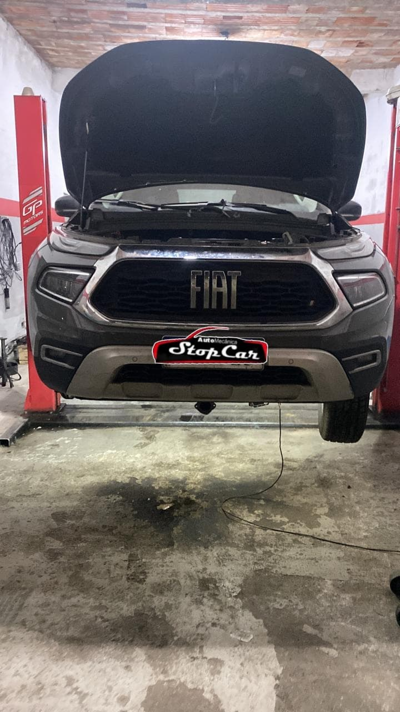
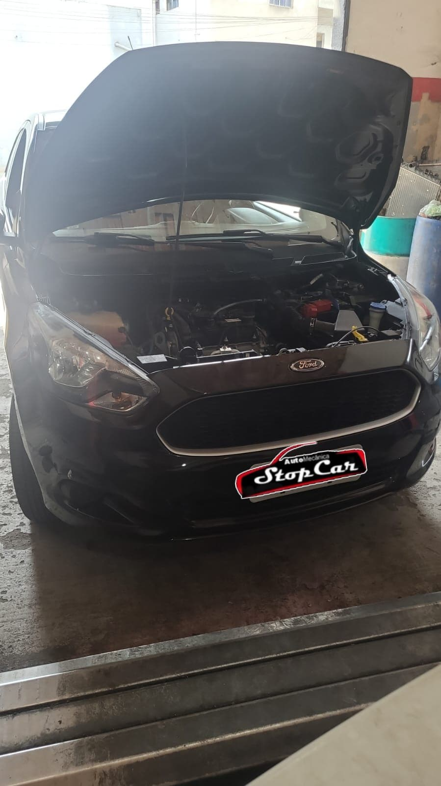
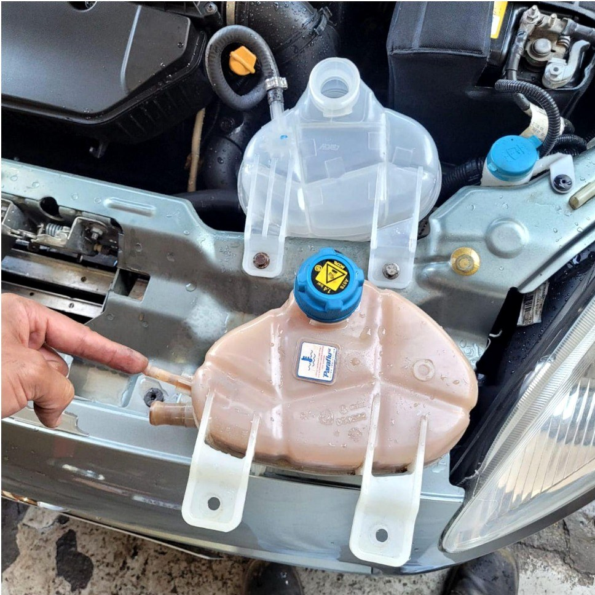
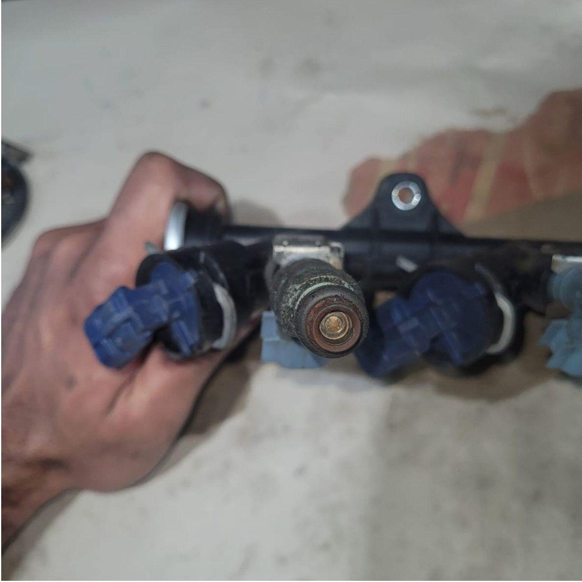
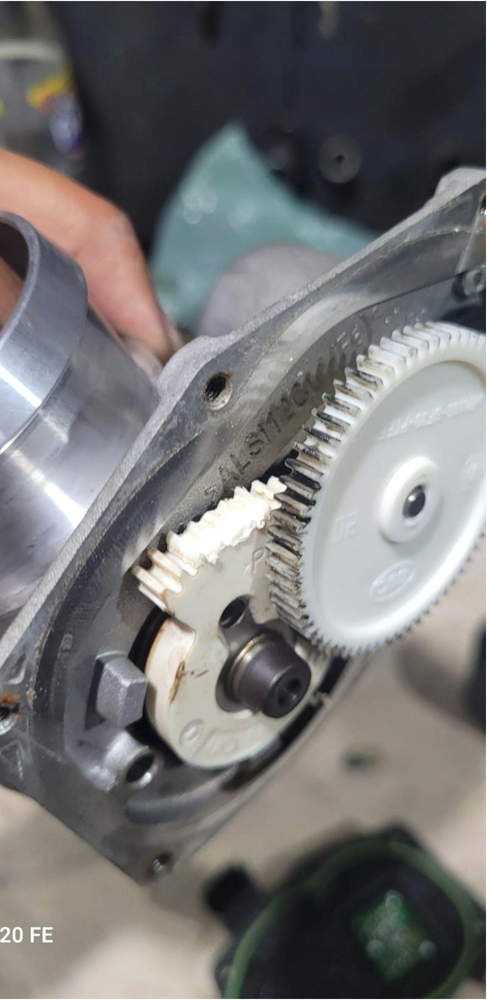

# Código completo — Stop Car Centro Automotivo

Este documento reúne o conteúdo integral dos arquivos de texto e SVG criados ou modificados. As imagens JPEG e WebP são arquivos binários e estão incluídas no projeto e no ZIP final.


## `index.html`

~~~~html
<!doctype html>
<html lang="pt-BR">
<head>
  <meta charset="utf-8">
  <meta name="viewport" content="width=device-width, initial-scale=1">
  <title>Stop Car | Oficina Mecânica em Francisco Morato</title>
  <meta name="description" content="Oficina mecânica em Francisco Morato. Diagnóstico explicado, orçamento apresentado antes do serviço e atendimento também aos sábados.">
  <meta name="author" content="Stop Car Centro Automotivo">
  <meta name="robots" content="index, follow, max-image-preview:large">
  <meta name="theme-color" content="#07152f">
  <meta name="format-detection" content="telephone=no">

  <meta property="og:type" content="website">
  <meta property="og:locale" content="pt_BR">
  <meta property="og:site_name" content="Stop Car Centro Automotivo">
  <meta property="og:title" content="Stop Car | Oficina Mecânica em Francisco Morato">
  <meta property="og:description" content="Seu veículo é avaliado, o problema é explicado e o serviço começa somente após a sua aprovação.">
  <meta property="og:image" content="assets/og-stop-car.jpg">
  <meta property="og:image:width" content="1200">
  <meta property="og:image:height" content="630">
  <meta property="og:image:alt" content="Stop Car Centro Automotivo em Francisco Morato">

  <link rel="icon" href="assets/favicon.svg" type="image/svg+xml">
  <link rel="preload" as="image" href="assets/oficina-elevador.webp" type="image/webp">
  <link rel="stylesheet" href="style.css">
  <!-- PERSONALIZAR: insira a URL canônica e og:url somente após definir o domínio oficial. -->

  <script type="application/ld+json">
  {
    "@context": "https://schema.org",
    "@type": "AutoRepair",
    "name": "Stop Car Centro Automotivo",
    "description": "Oficina mecânica em Francisco Morato com diagnóstico explicado e orçamento apresentado antes da execução do serviço.",
    "image": [
      "assets/oficina-elevador.jpg",
      "assets/oficina-motor.jpg",
      "assets/servico-arrefecimento.jpg",
      "assets/servico-injecao.jpg",
      "assets/servico-componente.jpg"
    ],
    "telephone": "+55 11 95023-0408",
    "address": {
      "@type": "PostalAddress",
      "streetAddress": "Avenida São Paulo, 565 - Jardim Eliza",
      "addressLocality": "Francisco Morato",
      "addressRegion": "SP",
      "addressCountry": "BR"
    },
    "openingHoursSpecification": [
      {
        "@type": "OpeningHoursSpecification",
        "dayOfWeek": ["Monday", "Tuesday", "Wednesday", "Thursday", "Friday"],
        "opens": "08:30",
        "closes": "18:00"
      },
      {
        "@type": "OpeningHoursSpecification",
        "dayOfWeek": "Saturday",
        "opens": "08:00",
        "closes": "15:00"
      }
    ]
  }
  </script>
</head>
<body>
  <a class="skip-link" href="#conteudo">Pular para o conteúdo</a>

  <div class="topbar" aria-label="Informações rápidas">
    <div class="container topbar__inner">
      <a href="tel:+5511950230408">(11) 95023-0408</a>
      <span>Seg.–sex. 8h30–18h <span aria-hidden="true">•</span> Sáb. 8h–15h</span>
      <a href="#localizacao">Francisco Morato — SP</a>
    </div>
  </div>

  <header class="site-header" id="inicio">
    <div class="container site-header__inner">
      <a class="brand" href="#inicio" aria-label="Stop Car Centro Automotivo — voltar ao início">
        
      </a>

      <button class="menu-toggle" type="button" aria-expanded="false" aria-controls="menu-principal" aria-label="Abrir menu">
        <span aria-hidden="true"></span>
        <span aria-hidden="true"></span>
        <span aria-hidden="true"></span>
      </button>

      <nav class="nav" id="menu-principal" aria-label="Navegação principal">
        <a href="#sobre">Sobre</a>
        <a href="#servicos">Serviços</a>
        <a href="#trabalhos">Trabalhos</a>
        <a href="#processo">Como funciona</a>
        <a href="#duvidas">Dúvidas</a>
        <a href="#localizacao">Localização</a>
        <a class="button button--small js-whatsapp" href="#contato" data-whatsapp-message="Olá! Gostaria de agendar uma avaliação na Stop Car.">Agendar avaliação</a>
      </nav>
    </div>
  </header>

  <button class="menu-backdrop" type="button" aria-label="Fechar menu" hidden></button>

  <main id="conteudo">
    <section class="hero" aria-labelledby="hero-title">
      <div class="container hero__grid">
        <div class="hero__content reveal">
          <span class="eyebrow">Oficina mecânica em Francisco Morato</span>
          <h1 id="hero-title">Diagnóstico claro. <strong>Serviço só depois da sua aprovação.</strong></h1>
          <p class="hero__lead">A Stop Car avalia o veículo, explica o problema e apresenta o orçamento antes de iniciar qualquer reparo.</p>

          <div class="hero__actions">
            <a class="button js-whatsapp" href="#contato" data-whatsapp-message="Olá! Gostaria de solicitar um orçamento na Stop Car.">Falar pelo WhatsApp</a>
            <a class="button button--outline" href="#servicos">Ver serviços</a>
          </div>
          <p class="microcopy">O WhatsApp será aberto com uma mensagem pronta para você revisar antes de enviar.</p>

          <ul class="trust-list" aria-label="Diferenciais principais">
            <li>Mais de 10 anos de experiência</li>
            <li>Orçamento antes da execução</li>
            <li>Atendimento aos sábados</li>
          </ul>

          <dl class="hero__facts">
            <div>
              <dt>Endereço</dt>
              <dd>Av. São Paulo, 565 — Jardim Eliza</dd>
            </div>
            <div>
              <dt>Horário</dt>
              <dd>Seg.–sex. 8h30–18h · Sáb. 8h–15h</dd>
            </div>
          </dl>
        </div>

        <figure class="hero__media reveal">
          <picture>
            <source srcset="assets/oficina-elevador.webp" type="image/webp">
            
          </picture>
          <figcaption>
            <span>Estrutura preparada para fotos reais</span>
            <strong>Atendimento automotivo em Francisco Morato</strong>
          </figcaption>
        </figure>
      </div>
    </section>

    <section class="proof-strip" aria-label="Compromissos de atendimento">
      <div class="container proof-strip__grid">
        <article><strong>10+</strong><span>anos de experiência</span></article>
        <article><strong>Avaliação</strong><span>antes da recomendação</span></article>
        <article><strong>Explicação</strong><span>simples e objetiva</span></article>
        <article><strong>Aprovação</strong><span>antes do serviço</span></article>
      </div>
    </section>

    <section class="section" id="sobre">
      <div class="container about">
        <div class="about__visual reveal">
          <figure class="media-card">
            <picture>
              <source srcset="assets/oficina-motor.webp" type="image/webp">
              
            </picture>
            <figcaption>Diagnóstico e manutenção com comunicação clara.</figcaption>
          </figure>
          <div class="experience-badge" aria-label="Mais de dez anos de experiência"><strong>10+</strong><span>anos no ramo automotivo</span></div>
        </div>

        <div class="about__content reveal">
          <span class="eyebrow eyebrow--dark">Sobre a Stop Car</span>
          <h2>Você sabe o que será feito no seu veículo.</h2>
          <p>A Stop Car Centro Automotivo atende em Francisco Morato com foco em manutenção preventiva e corretiva. O processo começa pela avaliação do veículo e pela explicação do que foi encontrado.</p>
          <p>Depois, o orçamento é apresentado. O serviço começa somente após a aprovação do cliente.</p>

          <div class="principles">
            <article>
              <span aria-hidden="true">01</span>
              <div><h3>Diagnóstico antes do reparo</h3><p>Os sintomas são avaliados antes da indicação do serviço.</p></div>
            </article>
            <article>
              <span aria-hidden="true">02</span>
              <div><h3>Explicação sem complicação</h3><p>O problema é apresentado de forma direta e fácil de entender.</p></div>
            </article>
            <article>
              <span aria-hidden="true">03</span>
              <div><h3>Autorização do cliente</h3><p>Nenhum reparo começa antes da aprovação do orçamento.</p></div>
            </article>
          </div>
        </div>
      </div>
    </section>

    <section class="section section--soft" id="servicos">
      <div class="container">
        <div class="section-heading reveal">
          <div>
            <span class="eyebrow eyebrow--dark">Serviços automotivos</span>
            <h2>Cuidados para os principais sistemas do veículo.</h2>
          </div>
          <p>Selecione um serviço para abrir o WhatsApp com uma mensagem específica.</p>
        </div>

        <div class="services-grid">
          <article class="service-card reveal">
            <span class="service-card__number" aria-hidden="true">01</span>
            <div class="service-card__icon" aria-hidden="true">R</div>
            <h3>Revisão preventiva</h3>
            <p>Verificação de itens importantes para reduzir riscos e identificar desgastes antes que aumentem.</p>
            <button class="service-card__action" type="button" data-service="revisão preventiva">Pedir orçamento</button>
          </article>
          <article class="service-card reveal">
            <span class="service-card__number" aria-hidden="true">02</span>
            <div class="service-card__icon" aria-hidden="true">M</div>
            <h3>Motor e componentes</h3>
            <p>Avaliação de ruídos, vazamentos, desempenho e componentes ligados ao funcionamento do motor.</p>
            <button class="service-card__action" type="button" data-service="motor e componentes">Pedir orçamento</button>
          </article>
          <article class="service-card reveal">
            <span class="service-card__number" aria-hidden="true">03</span>
            <div class="service-card__icon" aria-hidden="true">F</div>
            <h3>Freios</h3>
            <p>Avaliação de pastilhas, discos, fluido e demais componentes do sistema de frenagem.</p>
            <button class="service-card__action" type="button" data-service="freios">Pedir orçamento</button>
          </article>
          <article class="service-card reveal">
            <span class="service-card__number" aria-hidden="true">04</span>
            <div class="service-card__icon" aria-hidden="true">S</div>
            <h3>Suspensão e direção</h3>
            <p>Inspeção de amortecedores, buchas, pivôs, terminais e componentes de estabilidade.</p>
            <button class="service-card__action" type="button" data-service="suspensão e direção">Pedir orçamento</button>
          </article>
          <article class="service-card reveal">
            <span class="service-card__number" aria-hidden="true">05</span>
            <div class="service-card__icon" aria-hidden="true">I</div>
            <h3>Injeção eletrônica</h3>
            <p>Leitura de falhas e análise de sensores, consumo, marcha irregular e luzes no painel.</p>
            <button class="service-card__action" type="button" data-service="injeção eletrônica">Pedir orçamento</button>
          </article>
          <article class="service-card reveal">
            <span class="service-card__number" aria-hidden="true">06</span>
            <div class="service-card__icon" aria-hidden="true">A</div>
            <h3>Sistema de arrefecimento</h3>
            <p>Manutenção de reservatório, radiador, mangueiras, válvula termostática e fluido.</p>
            <button class="service-card__action" type="button" data-service="sistema de arrefecimento">Pedir orçamento</button>
          </article>
          <article class="service-card reveal">
            <span class="service-card__number" aria-hidden="true">07</span>
            <div class="service-card__icon" aria-hidden="true">E</div>
            <h3>Elétrica automotiva</h3>
            <p>Avaliação de bateria, alternador, motor de partida, ignição e circuitos elétricos.</p>
            <button class="service-card__action" type="button" data-service="elétrica automotiva">Pedir orçamento</button>
          </article>
          <article class="service-card reveal">
            <span class="service-card__number" aria-hidden="true">08</span>
            <div class="service-card__icon" aria-hidden="true">O</div>
            <h3>Óleo, filtros, correias e embreagem</h3>
            <p>Trocas e manutenções periódicas conforme a necessidade e a especificação do veículo.</p>
            <button class="service-card__action" type="button" data-service="óleo, filtros, correias ou embreagem">Pedir orçamento</button>
          </article>
        </div>

        <div class="inline-cta reveal">
          <p>Não sabe qual serviço selecionar? Descreva o sintoma e a oficina orienta o próximo passo.</p>
          <a class="button button--dark" href="#contato">Descrever o problema</a>
        </div>
      </div>
    </section>

    <section class="section work" id="trabalhos">
      <div class="container">
        <div class="section-heading section-heading--light reveal">
          <div>
            <span class="eyebrow">Trabalhos da oficina</span>
            <h2>Espaço preparado para mostrar serviços reais.</h2>
          </div>
          <p>As imagens temporárias mantêm o layout completo. Substitua pelos arquivos reais com os mesmos nomes na pasta <code>assets</code>.</p>
        </div>

        <div class="gallery" aria-label="Galeria de trabalhos">
          <button class="gallery-card gallery-card--wide reveal" type="button" data-lightbox data-full="assets/servico-arrefecimento.jpg" data-caption="Manutenção no sistema de arrefecimento">
            <picture>
              <source srcset="assets/servico-arrefecimento.webp" type="image/webp">
              
            </picture>
            <span class="gallery-card__caption"><strong>Sistema de arrefecimento</strong><small>Verificação e manutenção de componentes.</small></span>
          </button>

          <button class="gallery-card reveal" type="button" data-lightbox data-full="assets/servico-injecao.jpg" data-caption="Análise de componente da injeção eletrônica">
            <picture>
              <source srcset="assets/servico-injecao.webp" type="image/webp">
              
            </picture>
            <span class="gallery-card__caption"><strong>Injeção eletrônica</strong><small>Análise de componentes e funcionamento.</small></span>
          </button>

          <button class="gallery-card gallery-card--tall reveal" type="button" data-lightbox data-full="assets/servico-componente.jpg" data-caption="Componente mecânico durante reparo">
            <picture>
              <source srcset="assets/servico-componente.webp" type="image/webp">
              
            </picture>
            <span class="gallery-card__caption"><strong>Reparo de componentes</strong><small>Atenção aos detalhes durante o serviço.</small></span>
          </button>
        </div>
        <p class="gallery__hint">Use Enter, Espaço ou clique para ampliar. No lightbox, use as setas do teclado para navegar.</p>
      </div>
    </section>

    <section class="section" id="processo">
      <div class="container">
        <div class="section-heading reveal">
          <div>
            <span class="eyebrow eyebrow--dark">Como funciona</span>
            <h2>Do primeiro contato à execução do serviço.</h2>
          </div>
          <p>Um processo simples para você entender cada etapa antes de autorizar.</p>
        </div>

        <ol class="process">
          <li class="reveal"><span>01</span><h3>Descreva o problema</h3><p>Conte os sintomas, ruídos ou o serviço desejado.</p></li>
          <li class="reveal"><span>02</span><h3>Leve o veículo</h3><p>A avaliação precisa ser feita na oficina.</p></li>
          <li class="reveal"><span>03</span><h3>Avaliação técnica</h3><p>A equipe verifica o veículo e busca a origem do problema.</p></li>
          <li class="reveal"><span>04</span><h3>Diagnóstico explicado</h3><p>Você recebe uma explicação clara do que foi encontrado.</p></li>
          <li class="reveal"><span>05</span><h3>Orçamento e aprovação</h3><p>Os valores são apresentados antes da execução.</p></li>
          <li class="reveal"><span>06</span><h3>Serviço realizado</h3><p>O reparo começa somente após a sua autorização.</p></li>
        </ol>
      </div>
    </section>

    <section class="reviews" id="avaliacoes">
      <div class="container reviews__grid reveal">
        <div>
          <span class="eyebrow">Avaliações públicas</span>
          <h2>Consulte os comentários no perfil real do Google.</h2>
          <p>O site não exibe notas ou depoimentos inventados. O botão abre o perfil externo da Stop Car.</p>
        </div>
        <a class="button button--light" href="https://maps.google.com/maps?vet=10CAAQoqAOahcKEwiY2u2u1uiVAxUAAAAAHQAAAAAQBg..i&sca_esv=1c6902ee83d0e082&pvq=Cg0vZy8xMWg5eGtibmY3Ig4KCHN0b3AgY2FyEAIYAw&lqi=ChlzdG9wIGNhciBmcmFuY2lzY28gbW9yYXRvSKej1cinr4CACFonEAAQARgAGAEYAhgDIhlzdG9wIGNhciBmcmFuY2lzY28gbW9yYXRvkgEKY2FyX3JlcGFpcg&fvr=1&cs=0&um=1&ie=UTF-8&fb=1&gl=br&sa=X&ftid=0x94cee6cf14eeea89:0x6dfe22f83ed072c6" target="_blank" rel="noopener noreferrer">Ver avaliações no Google</a>
      </div>
    </section>

    <section class="section section--soft" id="duvidas">
      <div class="container faq-layout">
        <div class="faq-intro reveal">
          <span class="eyebrow eyebrow--dark">Perguntas frequentes</span>
          <h2>Informações antes de levar o carro.</h2>
          <p>As respostas abaixo usam apenas dados confirmados da Stop Car.</p>
          <a class="text-link" href="#contato">Ainda tenho uma dúvida</a>
        </div>

        <div class="faq reveal">
          <details>
            <summary>Preciso agendar antes de levar o carro?</summary>
            <p>Entre em contato pelo WhatsApp para explicar o problema e combinar o melhor momento para levar o veículo.</p>
          </details>
          <details>
            <summary>A oficina atende aos sábados?</summary>
            <p>Sim. Aos sábados, o atendimento é das 8h às 15h.</p>
          </details>
          <details>
            <summary>O serviço começa antes da aprovação?</summary>
            <p>Não. O veículo é avaliado, o diagnóstico é explicado e o orçamento é apresentado antes da execução.</p>
          </details>
          <details>
            <summary>Como solicito um orçamento?</summary>
            <p>Você pode usar o formulário desta página ou abrir o WhatsApp pelos botões do site.</p>
          </details>
          <details>
            <summary>Onde a oficina está localizada?</summary>
            <p>Na Avenida São Paulo, 565, Jardim Eliza, Francisco Morato — SP.</p>
          </details>
          <details>
            <summary>Quais manutenções são realizadas?</summary>
            <p>A Stop Car trabalha com os serviços exibidos nesta página, como revisão, motor, freios, suspensão, injeção, arrefecimento, elétrica e itens de manutenção periódica.</p>
          </details>
          <details>
            <summary>O orçamento é concluído apenas pelo site?</summary>
            <p>Não. O site prepara o contato. A avaliação do veículo é necessária para confirmar o diagnóstico e o orçamento.</p>
          </details>
          <details>
            <summary>Posso explicar o problema pelo WhatsApp?</summary>
            <p>Sim. Descreva os sintomas para iniciar o atendimento e receber orientação sobre o próximo passo.</p>
          </details>
        </div>
      </div>
    </section>

    <section class="section contact" id="contato">
      <div class="container contact__grid">
        <div class="contact__info reveal">
          <span class="eyebrow">Solicite uma avaliação</span>
          <h2>Conte o que está acontecendo com o veículo.</h2>
          <p>Preencha os dados. O site organiza a mensagem e abre o WhatsApp para você revisar antes de enviar.</p>

          <dl class="contact-list">
            <div><dt>Telefone e WhatsApp</dt><dd><a href="tel:+5511950230408">(11) 95023-0408</a></dd></div>
            <div><dt>Endereço</dt><dd>Avenida São Paulo, 565 — Jardim Eliza</dd></div>
            <div><dt>Segunda a sexta</dt><dd>8h30 às 18h</dd></div>
            <div><dt>Sábado</dt><dd>8h às 15h</dd></div>
          </dl>

          <p class="privacy-note">As informações ficam no navegador e são usadas apenas para preparar a mensagem. <a href="politica-de-privacidade.html">Leia a política de privacidade</a>.</p>
        </div>

        <form class="budget-form reveal" id="budget-form" novalidate>
          <div class="form-grid">
            <div class="field">
              <label for="nome">Nome <span aria-hidden="true">*</span></label>
              <input id="nome" name="nome" type="text" autocomplete="name" minlength="2" maxlength="80" required aria-describedby="erro-nome">
              <span class="field__error" id="erro-nome" aria-live="polite"></span>
            </div>
            <div class="field">
              <label for="telefone">Telefone <span aria-hidden="true">*</span></label>
              <input id="telefone" name="telefone" type="tel" inputmode="tel" autocomplete="tel" placeholder="(11) 99999-9999" required aria-describedby="erro-telefone">
              <span class="field__error" id="erro-telefone" aria-live="polite"></span>
            </div>
            <div class="field">
              <label for="modelo">Modelo do veículo <span aria-hidden="true">*</span></label>
              <input id="modelo" name="modelo" type="text" autocomplete="off" minlength="2" maxlength="80" placeholder="Ex.: Onix 1.0" required aria-describedby="erro-modelo">
              <span class="field__error" id="erro-modelo" aria-live="polite"></span>
            </div>
            <div class="field">
              <label for="ano">Ano</label>
              <input id="ano" name="ano" type="text" inputmode="numeric" maxlength="4" placeholder="Ex.: 2018" aria-describedby="erro-ano">
              <span class="field__error" id="erro-ano" aria-live="polite"></span>
            </div>
            <div class="field field--full">
              <label for="servico">Serviço desejado <span aria-hidden="true">*</span></label>
              <select id="servico" name="servico" required aria-describedby="erro-servico">
                <option value="">Selecione uma opção</option>
                <option>Revisão preventiva</option>
                <option>Motor e componentes</option>
                <option>Freios</option>
                <option>Suspensão e direção</option>
                <option>Injeção eletrônica</option>
                <option>Sistema de arrefecimento</option>
                <option>Elétrica automotiva</option>
                <option>Óleo, filtros, correias ou embreagem</option>
                <option>Não sei identificar</option>
              </select>
              <span class="field__error" id="erro-servico" aria-live="polite"></span>
            </div>
            <div class="field field--full">
              <label for="problema">Descrição do problema <span aria-hidden="true">*</span></label>
              <textarea id="problema" name="problema" rows="5" minlength="8" maxlength="700" placeholder="Conte os sintomas, ruídos ou quando o problema acontece." required aria-describedby="problema-ajuda erro-problema"></textarea>
              <span class="field__help" id="problema-ajuda">Não informe senhas, dados bancários ou informações sensíveis.</span>
              <span class="field__error" id="erro-problema" aria-live="polite"></span>
            </div>
          </div>

          <button class="button budget-form__submit" type="submit">Preparar mensagem no WhatsApp</button>
          <p class="form-status" id="form-status" role="status" aria-live="polite"></p>
          <noscript><p class="form-status is-error">Ative o JavaScript para preparar a mensagem automaticamente.</p></noscript>
        </form>
      </div>
    </section>

    <section class="section location" id="localizacao">
      <div class="container">
        <div class="section-heading reveal">
          <div>
            <span class="eyebrow eyebrow--dark">Localização</span>
            <h2>Encontre a Stop Car em Francisco Morato.</h2>
          </div>
          <div>
            <p>Avenida São Paulo, 565 — Jardim Eliza — Francisco Morato/SP.</p>
            <a class="text-link" href="https://www.google.com/maps/search/?api=1&query=Avenida+S%C3%A3o+Paulo%2C+565%2C+Jardim+Eliza%2C+Francisco+Morato%2C+SP" target="_blank" rel="noopener noreferrer">Abrir rota no Google Maps</a>
          </div>
        </div>

        <div class="map reveal">
          <iframe title="Mapa da Stop Car Centro Automotivo em Francisco Morato" src="https://www.google.com/maps?q=Avenida%20S%C3%A3o%20Paulo%2C%20565%2C%20Jardim%20Eliza%2C%20Francisco%20Morato%20-%20SP&output=embed" width="1200" height="520" loading="lazy" referrerpolicy="no-referrer-when-downgrade" allowfullscreen></iframe>
        </div>
      </div>
    </section>

    <section class="final-cta">
      <div class="container final-cta__inner reveal">
        <div>
          <span class="eyebrow">Próximo passo</span>
          <h2>Explique o problema e combine a avaliação.</h2>
          <p>O atendimento começa com uma conversa simples pelo WhatsApp.</p>
        </div>
        <a class="button button--light js-whatsapp" href="#contato" data-whatsapp-message="Olá! Gostaria de explicar um problema do meu veículo e combinar uma avaliação na Stop Car.">Chamar a Stop Car</a>
      </div>
    </section>
  </main>

  <footer class="footer">
    <div class="container footer__grid">
      <div class="footer__brand">
        
        <p>Oficina mecânica em Francisco Morato com diagnóstico explicado e orçamento antes da execução.</p>
      </div>
      <nav aria-label="Links do rodapé">
        <h2>Navegação</h2>
        <a href="#sobre">Sobre</a>
        <a href="#servicos">Serviços</a>
        <a href="#processo">Como funciona</a>
        <a href="#duvidas">Dúvidas</a>
      </nav>
      <div>
        <h2>Contato</h2>
        <a href="tel:+5511950230408">(11) 95023-0408</a>
        <p>Av. São Paulo, 565<br>Jardim Eliza — Francisco Morato/SP</p>
      </div>
      <div>
        <h2>Horários</h2>
        <p>Segunda a sexta<br><strong>8h30 às 18h</strong></p>
        <p>Sábado<br><strong>8h às 15h</strong></p>
      </div>
    </div>
    <div class="container footer__bottom">
      <p>© <span id="current-year">2026</span> Stop Car Centro Automotivo. Todos os direitos reservados.</p>
      <div>
        <a href="politica-de-privacidade.html">Política de privacidade</a>
        <a href="https://www.google.com/maps/search/?api=1&query=Avenida+S%C3%A3o+Paulo%2C+565%2C+Jardim+Eliza%2C+Francisco+Morato%2C+SP" target="_blank" rel="noopener noreferrer">Abrir localização</a>
      </div>
    </div>
  </footer>

  <a class="whatsapp-float js-whatsapp" href="#contato" data-whatsapp-message="Olá! Gostaria de solicitar um orçamento na Stop Car." aria-label="Falar com a Stop Car pelo WhatsApp">
    <svg viewBox="0 0 32 32" aria-hidden="true"><path d="M16.05 3A12.93 12.93 0 0 0 5 22.62L3.3 29l6.53-1.71A12.97 12.97 0 1 0 16.05 3Zm0 23.64a10.6 10.6 0 0 1-5.4-1.48l-.39-.23-3.88 1.02 1.04-3.78-.25-.39a10.64 10.64 0 1 1 8.88 4.86Zm5.83-7.96c-.32-.16-1.9-.94-2.2-1.04-.3-.11-.51-.16-.72.16-.21.32-.83 1.04-1.02 1.26-.19.21-.37.24-.69.08-.32-.16-1.35-.5-2.57-1.59-.95-.85-1.59-1.9-1.78-2.22-.19-.32-.02-.49.14-.65.15-.14.32-.37.48-.56.16-.19.21-.32.32-.53.11-.21.05-.4-.03-.56-.08-.16-.72-1.74-.99-2.38-.26-.63-.53-.54-.72-.55h-.62c-.21 0-.56.08-.85.4-.29.32-1.12 1.1-1.12 2.67s1.15 3.1 1.31 3.31c.16.21 2.26 3.45 5.48 4.84.77.33 1.36.53 1.83.68.77.24 1.47.21 2.02.13.62-.09 1.9-.78 2.17-1.53.27-.75.27-1.39.19-1.53-.08-.13-.29-.21-.61-.37Z"/></svg>
    <span>WhatsApp</span>
  </a>

  <dialog class="lightbox" id="photo-lightbox" aria-labelledby="lightbox-caption">
    <div class="lightbox__panel">
      <button class="lightbox__close" type="button" aria-label="Fechar imagem ampliada">×</button>
      <button class="lightbox__nav lightbox__nav--prev" type="button" aria-label="Imagem anterior">‹</button>
      <figure>
        
        <figcaption id="lightbox-caption"></figcaption>
      </figure>
      <button class="lightbox__nav lightbox__nav--next" type="button" aria-label="Próxima imagem">›</button>
      <p class="lightbox__counter" aria-live="polite"></p>
    </div>
  </dialog>

  <script src="script.js" defer></script>
</body>
</html>
~~~~


## `style.css`

~~~~css
/* =========================================================
   STOP CAR CENTRO AUTOMOTIVO
   HTML, CSS e JavaScript puro
   ========================================================= */

:root {
  --navy-950: #020814;
  --navy-900: #07152f;
  --navy-850: #0b1d3c;
  --navy-800: #10284f;
  --navy-700: #183866;
  --red-500: #e1242d;
  --red-600: #c8151e;
  --red-700: #a90f17;
  --white: #fff;
  --gray-25: #fbfcfe;
  --gray-50: #f5f7fa;
  --gray-100: #ebeff4;
  --gray-200: #d9e0e8;
  --gray-300: #c3ccd7;
  --gray-500: #657286;
  --gray-600: #4d5b70;
  --gray-700: #344156;
  --gray-900: #172033;
  --green: #1f9d55;
  --focus: #ff9da3;
  --container: min(1180px, calc(100% - 40px));
  --header-height: 78px;
  --menu-top: 116px;
  --section-space: clamp(76px, 8vw, 112px);
  --radius-sm: 10px;
  --radius-md: 18px;
  --radius-lg: 28px;
  --radius-xl: 38px;
  --radius-pill: 999px;
  --shadow-sm: 0 14px 35px rgba(2, 8, 20, 0.09);
  --shadow-md: 0 28px 70px rgba(2, 8, 20, 0.17);
  --shadow-red: 0 16px 40px rgba(200, 21, 30, 0.28);
  --transition-fast: 170ms ease;
  --transition-medium: 280ms ease;
}

*,
*::before,
*::after {
  box-sizing: border-box;
}

html {
  overflow-x: clip;
  scroll-behavior: smooth;
  scroll-padding-top: 108px;
}

body {
  margin: 0;
  min-width: 320px;
  overflow-x: clip;
  color: var(--gray-900);
  background: var(--white);
  font-family: Inter, ui-sans-serif, system-ui, -apple-system, BlinkMacSystemFont, "Segoe UI", sans-serif;
  font-size: 1rem;
  line-height: 1.65;
  text-rendering: optimizeLegibility;
  -webkit-font-smoothing: antialiased;
}

body.menu-open,
body.lightbox-open {
  overflow: hidden;
}

img,
picture,
svg,
iframe {
  display: block;
  max-width: 100%;
}

img {
  height: auto;
}

a {
  color: inherit;
  text-decoration: none;
}

button,
input,
select,
textarea {
  font: inherit;
}

button,
a {
  -webkit-tap-highlight-color: transparent;
}

button {
  color: inherit;
}

h1,
h2,
h3,
p,
figure,
dl,
dd,
ul,
ol {
  margin-top: 0;
}

h1,
h2 {
  margin-bottom: 0.45em;
  color: var(--navy-900);
  font-family: "Arial Narrow", "Roboto Condensed", Impact, sans-serif;
  font-weight: 800;
  line-height: 0.98;
  letter-spacing: -0.025em;
  text-transform: uppercase;
  text-wrap: balance;
}

h1 {
  max-width: 13ch;
  font-size: clamp(3rem, 7vw, 6.6rem);
}

h2 {
  max-width: 16ch;
  font-size: clamp(2.45rem, 5vw, 4.8rem);
}

h3 {
  margin-bottom: 0.55rem;
  color: var(--navy-900);
  font-size: clamp(1.05rem, 2vw, 1.25rem);
  line-height: 1.25;
}

p {
  color: var(--gray-600);
  text-wrap: pretty;
}

code {
  padding: 0.1em 0.35em;
  border-radius: 5px;
  background: rgba(255, 255, 255, 0.12);
  font-size: 0.9em;
}

::selection {
  color: var(--white);
  background: var(--red-600);
}

:focus-visible {
  outline: 3px solid var(--focus);
  outline-offset: 4px;
}

.container {
  width: var(--container);
  margin-inline: auto;
}

.section {
  position: relative;
  padding-block: var(--section-space);
}

.section--soft {
  background: var(--gray-50);
}

.skip-link {
  position: fixed;
  top: 10px;
  left: 10px;
  z-index: 9999;
  padding: 0.8rem 1rem;
  border-radius: var(--radius-sm);
  color: var(--white);
  background: var(--red-600);
  font-weight: 800;
  transform: translateY(-160%);
  transition: transform var(--transition-fast);
}

.skip-link:focus {
  transform: translateY(0);
}

.eyebrow {
  display: inline-flex;
  align-items: center;
  gap: 0.65rem;
  margin-bottom: 1rem;
  color: #ff9ca2;
  font-size: 0.75rem;
  font-weight: 800;
  letter-spacing: 0.15em;
  line-height: 1.3;
  text-transform: uppercase;
}

.eyebrow::before {
  width: 30px;
  height: 2px;
  background: currentColor;
  content: "";
}

.eyebrow--dark {
  color: var(--red-600);
}

.button {
  display: inline-flex;
  min-height: 52px;
  align-items: center;
  justify-content: center;
  gap: 0.6rem;
  padding: 0.9rem 1.3rem;
  border: 1px solid var(--red-600);
  border-radius: var(--radius-pill);
  color: var(--white);
  background: var(--red-600);
  box-shadow: var(--shadow-red);
  font-weight: 800;
  line-height: 1.2;
  text-align: center;
  cursor: pointer;
  transition: transform var(--transition-fast), background var(--transition-fast), border-color var(--transition-fast), box-shadow var(--transition-fast);
}

.button:hover {
  border-color: var(--red-700);
  background: var(--red-700);
  transform: translateY(-2px);
}

.button:active {
  transform: translateY(0);
}

.button:disabled {
  cursor: not-allowed;
  opacity: 0.64;
  transform: none;
}

.button--small {
  min-height: 44px;
  padding: 0.7rem 1rem;
  font-size: 0.88rem;
}

.button--outline {
  border-color: rgba(255, 255, 255, 0.38);
  color: var(--white);
  background: transparent;
  box-shadow: none;
}

.button--outline:hover {
  border-color: var(--white);
  color: var(--navy-900);
  background: var(--white);
}

.button--dark {
  border-color: var(--navy-900);
  background: var(--navy-900);
  box-shadow: 0 14px 36px rgba(7, 21, 47, 0.2);
}

.button--dark:hover {
  border-color: var(--navy-800);
  background: var(--navy-800);
}

.button--light {
  border-color: var(--white);
  color: var(--navy-900);
  background: var(--white);
  box-shadow: 0 16px 40px rgba(0, 0, 0, 0.16);
}

.button--light:hover {
  border-color: var(--gray-100);
  background: var(--gray-100);
}

.text-link {
  display: inline-flex;
  align-items: center;
  gap: 0.45rem;
  color: var(--red-600);
  font-weight: 800;
  text-decoration: underline;
  text-decoration-thickness: 2px;
  text-underline-offset: 4px;
}

.text-link::after {
  content: "→";
}

.topbar {
  position: relative;
  z-index: 1002;
  border-bottom: 1px solid rgba(255, 255, 255, 0.08);
  color: #cbd5e3;
  background: var(--navy-950);
  font-size: 0.76rem;
}

.topbar__inner {
  display: flex;
  min-height: 38px;
  align-items: center;
  justify-content: space-between;
  gap: 1rem;
}

.topbar a:hover {
  color: var(--white);
}

.site-header {
  position: sticky;
  top: 0;
  z-index: 1000;
  height: var(--header-height);
  border-bottom: 1px solid rgba(255, 255, 255, 0.08);
  color: var(--white);
  background: rgba(7, 21, 47, 0.94);
  backdrop-filter: blur(16px);
  transition: box-shadow var(--transition-fast), background var(--transition-fast);
}

.site-header.is-scrolled {
  background: rgba(7, 21, 47, 0.98);
  box-shadow: 0 12px 32px rgba(0, 0, 0, 0.2);
}

.site-header__inner {
  display: flex;
  height: 100%;
  align-items: center;
  justify-content: space-between;
  gap: 1.5rem;
}

.brand {
  display: inline-flex;
  width: clamp(190px, 18vw, 250px);
  flex: 0 0 auto;
  align-items: center;
}

.brand img {
  width: 100%;
}

.nav {
  display: flex;
  align-items: center;
  gap: clamp(0.65rem, 1.2vw, 1.25rem);
}

.nav > a:not(.button) {
  position: relative;
  padding-block: 0.75rem;
  color: #dce5f0;
  font-size: 0.88rem;
  font-weight: 700;
}

.nav > a:not(.button)::after {
  position: absolute;
  right: 0;
  bottom: 0.35rem;
  left: 0;
  height: 2px;
  background: var(--red-500);
  content: "";
  transform: scaleX(0);
  transform-origin: right;
  transition: transform var(--transition-fast);
}

.nav > a:hover,
.nav > a.is-active {
  color: var(--white);
}

.nav > a:hover::after,
.nav > a.is-active::after {
  transform: scaleX(1);
  transform-origin: left;
}

.menu-toggle {
  display: none;
  width: 46px;
  height: 46px;
  padding: 0;
  place-items: center;
  border: 1px solid rgba(255, 255, 255, 0.2);
  border-radius: 50%;
  color: var(--white);
  background: transparent;
  cursor: pointer;
}

.menu-toggle span {
  display: block;
  width: 21px;
  height: 2px;
  margin: 2.5px auto;
  border-radius: 2px;
  background: currentColor;
  transition: transform var(--transition-fast), opacity var(--transition-fast);
}

.menu-toggle[aria-expanded="true"] span:nth-child(1) {
  transform: translateY(7px) rotate(45deg);
}

.menu-toggle[aria-expanded="true"] span:nth-child(2) {
  opacity: 0;
}

.menu-toggle[aria-expanded="true"] span:nth-child(3) {
  transform: translateY(-7px) rotate(-45deg);
}

.menu-backdrop {
  position: fixed;
  inset: var(--menu-top) 0 0;
  z-index: 998;
  width: 100%;
  border: 0;
  background: rgba(2, 8, 20, 0.7);
  backdrop-filter: blur(4px);
}

.menu-backdrop[hidden] {
  display: none;
}

.hero {
  position: relative;
  overflow: hidden;
  color: var(--white);
  background:
    radial-gradient(circle at 15% 20%, rgba(225, 36, 45, 0.18), transparent 34%),
    linear-gradient(135deg, var(--navy-950), var(--navy-900) 52%, var(--navy-800));
}

.hero::before {
  position: absolute;
  inset: 0;
  background-image: linear-gradient(rgba(255, 255, 255, 0.025) 1px, transparent 1px), linear-gradient(90deg, rgba(255, 255, 255, 0.025) 1px, transparent 1px);
  background-size: 44px 44px;
  content: "";
  mask-image: linear-gradient(to bottom, #000, transparent 85%);
}

.hero__grid {
  position: relative;
  display: grid;
  min-height: min(830px, calc(100svh - 116px));
  grid-template-columns: minmax(0, 1.08fr) minmax(340px, 0.92fr);
  align-items: center;
  gap: clamp(2rem, 6vw, 5rem);
  padding-block: clamp(62px, 8vw, 108px);
}

.hero h1 {
  color: var(--white);
}

.hero h1 strong {
  display: block;
  color: #ff8d93;
  font-weight: inherit;
}

.hero__lead {
  max-width: 650px;
  margin-bottom: 1.6rem;
  color: #dce4ef;
  font-size: clamp(1.05rem, 1.8vw, 1.3rem);
}

.hero__actions {
  display: flex;
  flex-wrap: wrap;
  gap: 0.85rem;
}

.microcopy {
  max-width: 620px;
  margin: 0.85rem 0 1.5rem;
  color: #aebcd0;
  font-size: 0.82rem;
}

.trust-list {
  display: flex;
  flex-wrap: wrap;
  gap: 0.7rem 1.2rem;
  margin: 0 0 1.7rem;
  padding: 0;
  list-style: none;
}

.trust-list li {
  position: relative;
  padding-left: 1.35rem;
  color: #eef3f9;
  font-size: 0.9rem;
  font-weight: 700;
}

.trust-list li::before {
  position: absolute;
  top: 0.52em;
  left: 0;
  width: 8px;
  height: 8px;
  border-radius: 50%;
  background: var(--red-500);
  box-shadow: 0 0 0 4px rgba(225, 36, 45, 0.18);
  content: "";
}

.hero__facts {
  display: grid;
  grid-template-columns: repeat(2, minmax(0, 1fr));
  gap: 1rem;
  margin-bottom: 0;
}

.hero__facts div {
  padding-top: 1rem;
  border-top: 1px solid rgba(255, 255, 255, 0.18);
}

.hero__facts dt {
  margin-bottom: 0.25rem;
  color: #91a2ba;
  font-size: 0.72rem;
  font-weight: 800;
  letter-spacing: 0.1em;
  text-transform: uppercase;
}

.hero__facts dd {
  color: var(--white);
  font-size: 0.92rem;
  font-weight: 700;
}

.hero__media {
  position: relative;
  margin: 0;
  align-self: stretch;
  min-height: 540px;
  border-radius: 0 0 0 var(--radius-xl);
  overflow: hidden;
  box-shadow: var(--shadow-md);
}

.hero__media::after {
  position: absolute;
  inset: 0;
  background: linear-gradient(to top, rgba(2, 8, 20, 0.82), transparent 48%);
  content: "";
}

.hero__media picture,
.hero__media img {
  width: 100%;
  height: 100%;
}

.hero__media img {
  object-fit: cover;
}

.hero__media figcaption {
  position: absolute;
  right: 1.5rem;
  bottom: 1.5rem;
  left: 1.5rem;
  z-index: 1;
  padding: 1rem 1.1rem;
  border: 1px solid rgba(255, 255, 255, 0.16);
  border-radius: var(--radius-md);
  background: rgba(7, 21, 47, 0.72);
  backdrop-filter: blur(12px);
}

.hero__media figcaption span,
.hero__media figcaption strong {
  display: block;
}

.hero__media figcaption span {
  margin-bottom: 0.15rem;
  color: #ff9ca2;
  font-size: 0.7rem;
  font-weight: 800;
  letter-spacing: 0.1em;
  text-transform: uppercase;
}

.hero__media figcaption strong {
  color: var(--white);
  line-height: 1.35;
}

.proof-strip {
  position: relative;
  z-index: 2;
  color: var(--white);
  background: var(--red-600);
}

.proof-strip__grid {
  display: grid;
  grid-template-columns: repeat(4, minmax(0, 1fr));
}

.proof-strip article {
  min-height: 120px;
  padding: 1.5rem;
  border-right: 1px solid rgba(255, 255, 255, 0.19);
}

.proof-strip article:last-child {
  border-right: 0;
}

.proof-strip strong,
.proof-strip span {
  display: block;
}

.proof-strip strong {
  margin-bottom: 0.1rem;
  font-family: "Arial Narrow", Impact, sans-serif;
  font-size: clamp(1.55rem, 3vw, 2.35rem);
  line-height: 1;
  text-transform: uppercase;
}

.proof-strip span {
  color: #ffe7e8;
  font-size: 0.85rem;
}

.about {
  display: grid;
  grid-template-columns: minmax(320px, 0.82fr) minmax(0, 1.18fr);
  align-items: center;
  gap: clamp(2.5rem, 7vw, 6rem);
}

.about__visual {
  position: relative;
}

.media-card {
  margin: 0;
  border-radius: var(--radius-lg);
  overflow: hidden;
  background: var(--gray-100);
  box-shadow: var(--shadow-md);
}

.media-card picture,
.media-card img {
  width: 100%;
}

.media-card img {
  aspect-ratio: 4 / 5;
  object-fit: cover;
}

.media-card figcaption {
  padding: 1rem 1.2rem;
  color: var(--gray-600);
  background: var(--white);
  font-size: 0.86rem;
}

.experience-badge {
  position: absolute;
  right: -1.5rem;
  bottom: 5.5rem;
  display: grid;
  width: 150px;
  min-height: 150px;
  padding: 1rem;
  place-content: center;
  border: 8px solid var(--white);
  border-radius: 50%;
  color: var(--white);
  background: var(--red-600);
  box-shadow: var(--shadow-sm);
  text-align: center;
}

.experience-badge strong {
  font-family: "Arial Narrow", Impact, sans-serif;
  font-size: 3.3rem;
  line-height: 0.9;
}

.experience-badge span {
  font-size: 0.72rem;
  font-weight: 800;
  line-height: 1.25;
  text-transform: uppercase;
}

.about__content > p {
  max-width: 680px;
}

.principles {
  display: grid;
  gap: 1rem;
  margin-top: 2rem;
}

.principles article {
  display: grid;
  grid-template-columns: 52px minmax(0, 1fr);
  gap: 1rem;
  padding: 1rem 0;
  border-top: 1px solid var(--gray-200);
}

.principles article > span {
  display: grid;
  width: 44px;
  height: 44px;
  place-items: center;
  border-radius: 50%;
  color: var(--red-600);
  background: #fff0f1;
  font-weight: 900;
}

.principles p {
  margin-bottom: 0;
  font-size: 0.92rem;
}

.section-heading {
  display: grid;
  grid-template-columns: minmax(0, 1fr) minmax(280px, 0.55fr);
  align-items: end;
  gap: 2rem;
  margin-bottom: clamp(2.5rem, 5vw, 4.5rem);
}

.section-heading > p,
.section-heading > div:last-child p {
  max-width: 520px;
  margin-bottom: 0;
}

.section-heading--light h2,
.section-heading--light p {
  color: var(--white);
}

.services-grid {
  display: grid;
  grid-template-columns: repeat(4, minmax(0, 1fr));
  gap: 1rem;
}

.service-card {
  position: relative;
  display: flex;
  min-height: 340px;
  flex-direction: column;
  padding: 1.5rem;
  border: 1px solid var(--gray-200);
  border-radius: var(--radius-md);
  overflow: hidden;
  background: var(--white);
  box-shadow: 0 8px 24px rgba(7, 21, 47, 0.05);
  transition: transform var(--transition-medium), border-color var(--transition-medium), box-shadow var(--transition-medium);
}

.service-card::before {
  position: absolute;
  top: 0;
  right: 0;
  left: 0;
  height: 4px;
  background: var(--red-600);
  content: "";
  transform: scaleX(0);
  transform-origin: left;
  transition: transform var(--transition-medium);
}

.service-card:hover {
  border-color: #efb6b9;
  box-shadow: var(--shadow-sm);
  transform: translateY(-5px);
}

.service-card:hover::before {
  transform: scaleX(1);
}

.service-card__number {
  position: absolute;
  top: 1rem;
  right: 1.15rem;
  color: var(--gray-300);
  font-size: 0.75rem;
  font-weight: 900;
}

.service-card__icon {
  display: grid;
  width: 54px;
  height: 54px;
  margin-bottom: 1.5rem;
  place-items: center;
  border-radius: 16px;
  color: var(--white);
  background: var(--navy-900);
  font-family: "Arial Narrow", Impact, sans-serif;
  font-size: 1.65rem;
  font-weight: 900;
}

.service-card p {
  margin-bottom: 1.5rem;
  font-size: 0.9rem;
}

.service-card__action {
  display: inline-flex;
  min-height: 44px;
  align-items: center;
  align-self: flex-start;
  margin-top: auto;
  padding: 0;
  border: 0;
  color: var(--red-600);
  background: transparent;
  font-weight: 900;
  cursor: pointer;
}

.service-card__action::after {
  margin-left: 0.5rem;
  content: "→";
  transition: transform var(--transition-fast);
}

.service-card__action:hover::after {
  transform: translateX(4px);
}

.inline-cta {
  display: flex;
  margin-top: 2rem;
  align-items: center;
  justify-content: space-between;
  gap: 1.5rem;
  padding: 1.5rem 1.7rem;
  border: 1px solid var(--gray-200);
  border-radius: var(--radius-md);
  background: var(--white);
}

.inline-cta p {
  max-width: 660px;
  margin-bottom: 0;
}

.work {
  color: var(--white);
  background: var(--navy-900);
}

.gallery {
  display: grid;
  grid-template-columns: 1.25fr 0.75fr;
  grid-template-rows: repeat(2, minmax(240px, 1fr));
  gap: 1rem;
}

.gallery-card {
  position: relative;
  min-height: 270px;
  padding: 0;
  border: 1px solid rgba(255, 255, 255, 0.14);
  border-radius: var(--radius-md);
  overflow: hidden;
  color: var(--white);
  background: var(--navy-800);
  cursor: zoom-in;
}

.gallery-card--wide {
  grid-row: 1 / 3;
}

.gallery-card picture,
.gallery-card img {
  width: 100%;
  height: 100%;
}

.gallery-card img {
  object-fit: cover;
  transition: transform 520ms ease;
}

.gallery-card::after {
  position: absolute;
  inset: 0;
  background: linear-gradient(to top, rgba(2, 8, 20, 0.92), transparent 58%);
  content: "";
}

.gallery-card:hover img,
.gallery-card:focus-visible img {
  transform: scale(1.035);
}

.gallery-card__caption {
  position: absolute;
  right: 1.25rem;
  bottom: 1.15rem;
  left: 1.25rem;
  z-index: 1;
  text-align: left;
}

.gallery-card__caption strong,
.gallery-card__caption small {
  display: block;
}

.gallery-card__caption strong {
  margin-bottom: 0.2rem;
  font-size: 1.05rem;
}

.gallery-card__caption small {
  color: #c8d3e2;
  font-size: 0.82rem;
}

.gallery__hint {
  margin: 1rem 0 0;
  color: #aab8cb;
  font-size: 0.82rem;
}

.process {
  display: grid;
  grid-template-columns: repeat(3, minmax(0, 1fr));
  gap: 1rem;
  margin: 0;
  padding: 0;
  list-style: none;
  counter-reset: steps;
}

.process li {
  position: relative;
  min-height: 240px;
  padding: 1.7rem;
  border: 1px solid var(--gray-200);
  border-radius: var(--radius-md);
  background: var(--white);
}

.process li > span {
  display: inline-flex;
  margin-bottom: 2.3rem;
  color: var(--red-600);
  font-family: "Arial Narrow", Impact, sans-serif;
  font-size: 2rem;
  font-weight: 900;
}

.process p {
  margin-bottom: 0;
  font-size: 0.92rem;
}

.reviews {
  padding-block: clamp(58px, 7vw, 88px);
  color: var(--white);
  background:
    linear-gradient(120deg, rgba(225, 36, 45, 0.94), rgba(169, 15, 23, 0.96)),
    var(--red-600);
}

.reviews__grid {
  display: grid;
  grid-template-columns: minmax(0, 1fr) auto;
  align-items: center;
  gap: 2rem;
}

.reviews h2,
.reviews p {
  color: var(--white);
}

.reviews p {
  max-width: 680px;
  margin-bottom: 0;
}

.faq-layout {
  display: grid;
  grid-template-columns: minmax(280px, 0.65fr) minmax(0, 1.35fr);
  align-items: start;
  gap: clamp(2rem, 6vw, 5rem);
}

.faq-intro {
  position: sticky;
  top: 120px;
}

.faq {
  border-top: 1px solid var(--gray-300);
}

.faq details {
  border-bottom: 1px solid var(--gray-300);
}

.faq summary {
  position: relative;
  padding: 1.35rem 3rem 1.35rem 0;
  color: var(--navy-900);
  font-weight: 850;
  cursor: pointer;
  list-style: none;
}

.faq summary::-webkit-details-marker {
  display: none;
}

.faq summary::after {
  position: absolute;
  top: 1.3rem;
  right: 0.2rem;
  display: grid;
  width: 30px;
  height: 30px;
  place-items: center;
  border-radius: 50%;
  color: var(--red-600);
  background: #fff0f1;
  content: "+";
  font-size: 1.25rem;
  line-height: 1;
}

.faq details[open] summary::after {
  content: "−";
}

.faq details p {
  max-width: 760px;
  padding: 0 2rem 1.35rem 0;
}

.contact {
  color: var(--white);
  background: var(--navy-900);
}

.contact__grid {
  display: grid;
  grid-template-columns: minmax(300px, 0.72fr) minmax(0, 1.28fr);
  align-items: start;
  gap: clamp(2rem, 6vw, 5rem);
}

.contact h2,
.contact p,
.contact dt,
.contact dd,
.contact a {
  color: var(--white);
}

.contact__info > p {
  color: #cbd5e3;
}

.contact-list {
  margin: 2rem 0;
}

.contact-list div {
  padding: 1rem 0;
  border-top: 1px solid rgba(255, 255, 255, 0.14);
}

.contact-list dt {
  margin-bottom: 0.2rem;
  color: #8fa1b9;
  font-size: 0.72rem;
  font-weight: 800;
  letter-spacing: 0.1em;
  text-transform: uppercase;
}

.contact-list dd {
  font-weight: 750;
}

.privacy-note {
  font-size: 0.82rem;
}

.privacy-note a {
  text-decoration: underline;
  text-underline-offset: 3px;
}

.budget-form {
  padding: clamp(1.25rem, 3vw, 2rem);
  border: 1px solid rgba(255, 255, 255, 0.15);
  border-radius: var(--radius-lg);
  background: var(--white);
  box-shadow: var(--shadow-md);
}

.form-grid {
  display: grid;
  grid-template-columns: repeat(2, minmax(0, 1fr));
  gap: 1.05rem;
}

.field {
  min-width: 0;
}

.field--full {
  grid-column: 1 / -1;
}

.field label {
  display: inline-block;
  margin-bottom: 0.45rem;
  color: var(--navy-900);
  font-size: 0.86rem;
  font-weight: 800;
}

.field input,
.field select,
.field textarea {
  width: 100%;
  min-height: 50px;
  padding: 0.8rem 0.9rem;
  border: 1px solid var(--gray-300);
  border-radius: var(--radius-sm);
  color: var(--gray-900);
  background: var(--white);
  transition: border-color var(--transition-fast), box-shadow var(--transition-fast);
}

.field textarea {
  min-height: 135px;
  resize: vertical;
}

.field input:hover,
.field select:hover,
.field textarea:hover {
  border-color: var(--gray-500);
}

.field input:focus,
.field select:focus,
.field textarea:focus {
  border-color: var(--navy-700);
  outline: none;
  box-shadow: 0 0 0 4px rgba(24, 56, 102, 0.14);
}

.field input.is-invalid,
.field select.is-invalid,
.field textarea.is-invalid {
  border-color: var(--red-600);
  box-shadow: 0 0 0 4px rgba(200, 21, 30, 0.1);
}

.field__help,
.field__error {
  display: block;
  margin-top: 0.35rem;
  font-size: 0.76rem;
  line-height: 1.35;
}

.field__help {
  color: var(--gray-500);
}

.field__error {
  min-height: 1.05em;
  color: var(--red-700);
  font-weight: 700;
}

.budget-form__submit {
  width: 100%;
  margin-top: 1.25rem;
}

.form-status {
  min-height: 1.5em;
  margin: 0.8rem 0 0;
  color: var(--gray-600) !important;
  font-size: 0.84rem;
  text-align: center;
}

.form-status.is-error {
  color: var(--red-700) !important;
}

.form-status.is-success {
  color: #157544 !important;
}

.location {
  background: var(--white);
}

.map {
  border: 1px solid var(--gray-200);
  border-radius: var(--radius-lg);
  overflow: hidden;
  background: var(--gray-100);
  box-shadow: var(--shadow-sm);
}

.map iframe {
  width: 100%;
  height: clamp(360px, 52vw, 520px);
  border: 0;
}

.final-cta {
  padding-block: clamp(56px, 7vw, 86px);
  color: var(--white);
  background: var(--navy-800);
}

.final-cta__inner {
  display: grid;
  grid-template-columns: minmax(0, 1fr) auto;
  align-items: center;
  gap: 2rem;
}

.final-cta h2,
.final-cta p {
  color: var(--white);
}

.final-cta p {
  margin-bottom: 0;
}

.footer {
  color: #c8d3e2;
  background: var(--navy-950);
}

.footer__grid {
  display: grid;
  grid-template-columns: 1.5fr repeat(3, 1fr);
  gap: 2rem;
  padding-block: 3.5rem;
}

.footer__brand img {
  width: 220px;
  margin-bottom: 1.15rem;
}

.footer p,
.footer a {
  color: #aebbd0;
  font-size: 0.88rem;
}

.footer a {
  display: block;
  width: fit-content;
  margin-bottom: 0.45rem;
}

.footer a:hover {
  color: var(--white);
}

.footer h2 {
  margin-bottom: 1rem;
  color: var(--white);
  font-family: inherit;
  font-size: 0.78rem;
  letter-spacing: 0.11em;
  text-transform: uppercase;
}

.footer strong {
  color: var(--white);
}

.footer__bottom {
  display: flex;
  min-height: 74px;
  align-items: center;
  justify-content: space-between;
  gap: 1rem;
  border-top: 1px solid rgba(255, 255, 255, 0.1);
}

.footer__bottom p {
  margin-bottom: 0;
}

.footer__bottom > div {
  display: flex;
  flex-wrap: wrap;
  gap: 1rem;
}

.whatsapp-float {
  position: fixed;
  right: max(18px, env(safe-area-inset-right));
  bottom: max(18px, env(safe-area-inset-bottom));
  z-index: 900;
  display: inline-flex;
  min-height: 54px;
  align-items: center;
  gap: 0.55rem;
  padding: 0.8rem 1rem;
  border: 2px solid rgba(255, 255, 255, 0.75);
  border-radius: var(--radius-pill);
  color: var(--white);
  background: var(--green);
  box-shadow: 0 14px 38px rgba(20, 91, 51, 0.34);
  font-size: 0.87rem;
  font-weight: 850;
  transition: transform var(--transition-fast), background var(--transition-fast);
}

.whatsapp-float:hover {
  background: #167f45;
  transform: translateY(-3px);
}

.whatsapp-float svg {
  width: 25px;
  height: 25px;
  fill: currentColor;
}

.lightbox {
  width: 100%;
  max-width: none;
  height: 100%;
  max-height: none;
  padding: 1rem;
  border: 0;
  color: var(--white);
  background: transparent;
}

.lightbox::backdrop {
  background: rgba(2, 8, 20, 0.91);
  backdrop-filter: blur(8px);
}

.lightbox__panel {
  position: relative;
  display: grid;
  width: min(100%, 1120px);
  height: 100%;
  margin: auto;
  place-items: center;
}

.lightbox figure {
  display: grid;
  max-width: 100%;
  max-height: calc(100svh - 80px);
  margin: 0;
  place-items: center;
}

.lightbox img {
  max-width: 100%;
  max-height: calc(100svh - 130px);
  border-radius: var(--radius-md);
  object-fit: contain;
  background: var(--navy-950);
  box-shadow: var(--shadow-md);
}

.lightbox figcaption {
  margin-top: 0.85rem;
  color: var(--white);
  font-weight: 800;
  text-align: center;
}

.lightbox__close,
.lightbox__nav {
  position: absolute;
  z-index: 2;
  display: grid;
  width: 48px;
  height: 48px;
  padding: 0;
  place-items: center;
  border: 1px solid rgba(255, 255, 255, 0.3);
  border-radius: 50%;
  color: var(--white);
  background: rgba(7, 21, 47, 0.78);
  cursor: pointer;
  backdrop-filter: blur(10px);
}

.lightbox__close {
  top: 0;
  right: 0;
  font-size: 2rem;
  line-height: 1;
}

.lightbox__nav {
  top: 50%;
  font-size: 2.3rem;
  transform: translateY(-50%);
}

.lightbox__nav--prev {
  left: 0;
}

.lightbox__nav--next {
  right: 0;
}

.lightbox__counter {
  position: absolute;
  bottom: 0;
  margin: 0;
  color: #c8d3e2;
  font-size: 0.78rem;
}

.reveal {
  opacity: 0;
  transform: translateY(22px);
  transition: opacity 650ms ease, transform 650ms ease;
}

.reveal.is-visible {
  opacity: 1;
  transform: none;
}

.legal-page,
.not-found-page {
  background: var(--gray-50);
}

.legal-hero {
  padding-block: 3rem;
  color: var(--white);
  background: var(--navy-900);
}

.legal-hero .button {
  margin-bottom: 3rem;
}

.legal-hero h1,
.legal-hero p {
  color: var(--white);
}

.legal-hero h1 {
  max-width: none;
  font-size: clamp(3rem, 7vw, 5.5rem);
}

.legal-content {
  width: min(840px, calc(100% - 40px));
  margin-inline: auto;
  padding-block: clamp(3.5rem, 8vw, 6.5rem);
}

.legal-content h2 {
  max-width: none;
  margin-top: 2.3rem;
  font-family: inherit;
  font-size: 1.35rem;
  letter-spacing: 0;
  line-height: 1.25;
  text-transform: none;
}

.legal-content a {
  color: var(--red-600);
}

.legal-note {
  margin-top: 2.5rem;
  padding: 1.25rem;
  border-left: 4px solid var(--red-600);
  border-radius: 0 var(--radius-sm) var(--radius-sm) 0;
  background: #fff0f1;
  color: var(--gray-700);
}

.not-found {
  display: grid;
  width: min(720px, calc(100% - 40px));
  min-height: 100svh;
  margin-inline: auto;
  padding-block: 3rem;
  place-content: center;
  text-align: center;
}

.not-found img {
  width: 240px;
  margin: 0 auto 2rem;
}

.not-found h1 {
  max-width: none;
  font-size: clamp(3rem, 8vw, 5.5rem);
}

.not-found__code {
  margin-bottom: 0;
  color: var(--red-600);
  font-family: "Arial Narrow", Impact, sans-serif;
  font-size: clamp(5rem, 18vw, 10rem);
  font-weight: 900;
  line-height: 0.8;
}

.not-found .hero__actions {
  justify-content: center;
}

.not-found .button--outline {
  border-color: var(--navy-900);
  color: var(--navy-900);
}

.not-found .button--outline:hover {
  color: var(--white);
  background: var(--navy-900);
}

@media (max-width: 1080px) {
  :root {
    --header-height: 72px;
  }

  .menu-toggle {
    display: grid;
  }

  .nav {
    position: fixed;
    top: var(--menu-top);
    right: 0;
    z-index: 999;
    display: flex;
    width: min(390px, 92vw);
    max-height: calc(100svh - var(--menu-top));
    padding: 1rem;
    flex-direction: column;
    align-items: stretch;
    gap: 0;
    overflow-y: auto;
    border-left: 1px solid rgba(255, 255, 255, 0.1);
    background: var(--navy-900);
    box-shadow: -20px 20px 50px rgba(0, 0, 0, 0.26);
    transform: translateX(105%);
    visibility: hidden;
    transition: transform var(--transition-medium), visibility var(--transition-medium);
  }

  .nav.is-open {
    transform: translateX(0);
    visibility: visible;
  }

  .nav > a:not(.button) {
    min-height: 50px;
    padding: 0.85rem 0.6rem;
    border-bottom: 1px solid rgba(255, 255, 255, 0.1);
    font-size: 0.95rem;
  }

  .nav > a:not(.button)::after {
    display: none;
  }

  .nav .button {
    margin-top: 1rem;
  }

  .services-grid {
    grid-template-columns: repeat(2, minmax(0, 1fr));
  }

  .footer__grid {
    grid-template-columns: 1.4fr repeat(2, 1fr);
  }

  .footer__grid > div:last-child {
    grid-column: 2 / -1;
  }
}

@media (max-width: 860px) {
  .hero__grid,
  .about,
  .contact__grid,
  .faq-layout {
    grid-template-columns: 1fr;
  }

  .hero__grid {
    min-height: auto;
    padding-top: 56px;
  }

  .hero__media {
    min-height: 460px;
    border-radius: var(--radius-lg);
  }

  .about__visual {
    width: min(100%, 620px);
  }

  .experience-badge {
    right: 1rem;
  }

  .section-heading {
    grid-template-columns: 1fr;
    align-items: start;
    gap: 0.75rem;
  }

  .process {
    grid-template-columns: repeat(2, minmax(0, 1fr));
  }

  .faq-intro {
    position: static;
  }

  .reviews__grid,
  .final-cta__inner {
    grid-template-columns: 1fr;
    align-items: start;
  }

  .reviews__grid .button,
  .final-cta__inner .button {
    justify-self: start;
  }

  .footer__grid {
    grid-template-columns: repeat(2, minmax(0, 1fr));
  }

  .footer__brand {
    grid-column: 1 / -1;
  }

  .footer__grid > div:last-child {
    grid-column: auto;
  }
}

@media (max-width: 640px) {
  :root {
    --container: min(100% - 28px, 1180px);
  }

  html {
    scroll-padding-top: 88px;
  }

  body {
    padding-bottom: 0;
  }

  .topbar__inner {
    min-height: 34px;
    justify-content: center;
  }

  .topbar__inner span,
  .topbar__inner a:last-child {
    display: none;
  }

  .brand {
    width: 195px;
  }

  .hero__grid {
    gap: 2rem;
    padding-block: 48px 56px;
  }

  .hero h1 {
    font-size: clamp(2.7rem, 14vw, 4.2rem);
  }

  .hero__actions,
  .not-found .hero__actions {
    display: grid;
  }

  .hero__actions .button,
  .not-found .button {
    width: 100%;
  }

  .hero__facts {
    grid-template-columns: 1fr;
  }

  .hero__media {
    min-height: 390px;
  }

  .proof-strip__grid {
    grid-template-columns: repeat(2, minmax(0, 1fr));
  }

  .proof-strip article {
    min-height: 104px;
    padding: 1.2rem 1rem;
    border-bottom: 1px solid rgba(255, 255, 255, 0.19);
  }

  .proof-strip article:nth-child(2) {
    border-right: 0;
  }

  .proof-strip article:nth-child(n + 3) {
    border-bottom: 0;
  }

  .services-grid,
  .process,
  .form-grid,
  .footer__grid {
    grid-template-columns: 1fr;
  }

  .service-card {
    min-height: 0;
  }

  .inline-cta {
    align-items: stretch;
    flex-direction: column;
  }

  .gallery {
    grid-template-columns: 1fr;
    grid-template-rows: none;
  }

  .gallery-card,
  .gallery-card--wide,
  .gallery-card--tall {
    min-height: 290px;
    grid-row: auto;
  }

  .field--full {
    grid-column: auto;
  }

  .footer__brand,
  .footer__grid > div:last-child {
    grid-column: auto;
  }

  .footer__bottom {
    padding-block: 1.35rem 6.2rem;
    align-items: flex-start;
    flex-direction: column;
  }

  .whatsapp-float {
    right: max(12px, env(safe-area-inset-right));
    bottom: max(12px, env(safe-area-inset-bottom));
    width: 56px;
    height: 56px;
    min-height: 56px;
    padding: 0;
    justify-content: center;
  }

  .whatsapp-float span {
    position: absolute;
    width: 1px;
    height: 1px;
    overflow: hidden;
    clip: rect(0 0 0 0);
    white-space: nowrap;
  }

  .lightbox {
    padding: 0.6rem;
  }

  .lightbox__nav {
    top: auto;
    bottom: 0;
    transform: none;
  }

  .lightbox__nav--prev {
    left: calc(50% - 62px);
  }

  .lightbox__nav--next {
    right: calc(50% - 62px);
  }

  .lightbox__counter {
    bottom: 14px;
  }

  .lightbox figure {
    padding-bottom: 62px;
  }
}

@media (max-width: 380px) {
  :root {
    --container: min(100% - 22px, 1180px);
  }

  .brand {
    width: 178px;
  }

  .menu-toggle {
    width: 44px;
    height: 44px;
  }

  .hero__media {
    min-height: 340px;
  }

  .hero__media figcaption {
    right: 0.8rem;
    bottom: 0.8rem;
    left: 0.8rem;
  }

  .proof-strip strong {
    font-size: 1.45rem;
  }

  .experience-badge {
    width: 120px;
    min-height: 120px;
    border-width: 6px;
  }

  .experience-badge strong {
    font-size: 2.7rem;
  }
}

@media (prefers-reduced-motion: reduce) {
  html {
    scroll-behavior: auto;
  }

  *,
  *::before,
  *::after {
    scroll-behavior: auto !important;
    animation-duration: 0.01ms !important;
    animation-iteration-count: 1 !important;
    transition-duration: 0.01ms !important;
  }

  .reveal {
    opacity: 1;
    transform: none;
  }
}

@media (forced-colors: active) {
  .button,
  .service-card,
  .budget-form,
  .gallery-card {
    border: 1px solid ButtonText;
  }
}
~~~~


## `script.js`

~~~~javascript
"use strict";

(() => {
  /* Altere somente este valor para trocar o WhatsApp do site. */
  const WHATSAPP_NUMBER = "5511950230408";
  const MOBILE_BREAKPOINT = 1080;

  const body = document.body;
  const root = document.documentElement;
  const header = document.querySelector(".site-header");
  const menuButton = document.querySelector(".menu-toggle");
  const navigation = document.querySelector(".nav");
  const menuBackdrop = document.querySelector(".menu-backdrop");
  const navLinks = [...document.querySelectorAll('.nav a[href^="#"]')];
  const mobileMenuQuery = window.matchMedia(`(max-width: ${MOBILE_BREAKPOINT}px)`);

  let menuOpenedBy = null;

  const getFocusableElements = (container) => {
    if (!container) return [];
    return [...container.querySelectorAll('a[href], button:not([disabled]), input:not([disabled]), select:not([disabled]), textarea:not([disabled]), [tabindex]:not([tabindex="-1"])')]
      .filter((element) => !element.hasAttribute("hidden") && element.getAttribute("aria-hidden") !== "true");
  };

  const updateMenuPosition = () => {
    if (!header) return;
    const bottom = Math.max(0, Math.round(header.getBoundingClientRect().bottom));
    root.style.setProperty("--menu-top", `${bottom}px`);
  };

  const closeMenu = ({ returnFocus = false } = {}) => {
    if (!menuButton || !navigation) return;
    navigation.classList.remove("is-open");
    body.classList.remove("menu-open");
    menuButton.setAttribute("aria-expanded", "false");
    menuButton.setAttribute("aria-label", "Abrir menu");
    if (menuBackdrop) menuBackdrop.hidden = true;

    if (returnFocus && menuOpenedBy instanceof HTMLElement) {
      menuOpenedBy.focus();
    }
    menuOpenedBy = null;
  };

  const openMenu = () => {
    if (!menuButton || !navigation) return;
    updateMenuPosition();
    menuOpenedBy = document.activeElement;
    navigation.classList.add("is-open");
    body.classList.add("menu-open");
    menuButton.setAttribute("aria-expanded", "true");
    menuButton.setAttribute("aria-label", "Fechar menu");
    if (menuBackdrop) menuBackdrop.hidden = false;

    window.setTimeout(() => {
      navigation.querySelector("a[href], button:not([disabled])")?.focus({ preventScroll: true });
    }, 30);
  };

  if (menuButton && navigation) {
    menuButton.addEventListener("click", () => {
      navigation.classList.contains("is-open") ? closeMenu({ returnFocus: true }) : openMenu();
    });

    navLinks.forEach((link) => link.addEventListener("click", () => closeMenu()));
    menuBackdrop?.addEventListener("click", () => closeMenu({ returnFocus: true }));

    document.addEventListener("keydown", (event) => {
      if (!navigation.classList.contains("is-open")) return;

      if (event.key === "Escape") {
        event.preventDefault();
        closeMenu({ returnFocus: true });
        return;
      }

      if (event.key !== "Tab" || !mobileMenuQuery.matches) return;
      const focusable = getFocusableElements(navigation);
      if (!focusable.length) return;

      const first = focusable[0];
      const last = focusable[focusable.length - 1];
      if (event.shiftKey && document.activeElement === first) {
        event.preventDefault();
        last.focus();
      } else if (!event.shiftKey && document.activeElement === last) {
        event.preventDefault();
        first.focus();
      }
    });
  }

  const handleResponsiveMenu = (event) => {
    if (!event.matches) closeMenu();
    updateMenuPosition();
  };

  if (typeof mobileMenuQuery.addEventListener === "function") {
    mobileMenuQuery.addEventListener("change", handleResponsiveMenu);
  } else {
    mobileMenuQuery.addListener(handleResponsiveMenu);
  }

  window.addEventListener("resize", updateMenuPosition, { passive: true });
  window.addEventListener("load", updateMenuPosition, { once: true });
  updateMenuPosition();

  const updateHeader = () => {
    header?.classList.toggle("is-scrolled", window.scrollY > 18);
    if (navigation?.classList.contains("is-open")) updateMenuPosition();
  };

  updateHeader();
  window.addEventListener("scroll", updateHeader, { passive: true });

  const reduceMotion = window.matchMedia("(prefers-reduced-motion: reduce)").matches;
  const revealElements = document.querySelectorAll(".reveal");

  if ("IntersectionObserver" in window && !reduceMotion) {
    const revealObserver = new IntersectionObserver((entries, observer) => {
      entries.forEach((entry) => {
        if (!entry.isIntersecting) return;
        entry.target.classList.add("is-visible");
        observer.unobserve(entry.target);
      });
    }, { threshold: 0.1, rootMargin: "0px 0px -24px" });

    revealElements.forEach((element) => revealObserver.observe(element));
  } else {
    revealElements.forEach((element) => element.classList.add("is-visible"));
  }

  const sections = [...document.querySelectorAll("main section[id]")];
  const setActiveNav = (sectionId) => {
    navLinks.forEach((link) => {
      const active = link.getAttribute("href") === `#${sectionId}`;
      link.classList.toggle("is-active", active);
      active ? link.setAttribute("aria-current", "location") : link.removeAttribute("aria-current");
    });
  };

  if ("IntersectionObserver" in window && sections.length) {
    const visibleSections = new Map();
    const sectionObserver = new IntersectionObserver((entries) => {
      entries.forEach((entry) => {
        entry.isIntersecting ? visibleSections.set(entry.target.id, entry.intersectionRatio) : visibleSections.delete(entry.target.id);
      });

      const active = [...visibleSections.entries()].sort((a, b) => b[1] - a[1])[0];
      if (active) setActiveNav(active[0]);
    }, { rootMargin: "-30% 0px -58% 0px", threshold: [0, 0.1, 0.35, 0.65] });

    sections.forEach((section) => sectionObserver.observe(section));
  }

  const buildWhatsAppUrl = (message) => `https://wa.me/${WHATSAPP_NUMBER}?text=${encodeURIComponent(message)}`;

  const openWhatsApp = (message) => {
    const popup = window.open(buildWhatsAppUrl(message), "_blank", "noopener,noreferrer");
    if (popup) popup.opener = null;
  };

  document.querySelectorAll(".js-whatsapp").forEach((link) => {
    const message = link.dataset.whatsappMessage || "Olá! Gostaria de falar com a Stop Car.";
    link.setAttribute("href", buildWhatsAppUrl(message));
    link.setAttribute("target", "_blank");
    link.setAttribute("rel", "noopener noreferrer");
  });

  document.querySelectorAll("[data-service]").forEach((button) => {
    button.addEventListener("click", () => {
      const service = button.dataset.service || "um serviço automotivo";
      openWhatsApp(`Olá! Gostaria de solicitar um orçamento para ${service}.`);
    });
  });

  const form = document.querySelector("#budget-form");
  const formStatus = document.querySelector("#form-status");
  const phoneInput = document.querySelector("#telefone");
  const yearInput = document.querySelector("#ano");

  const setFormStatus = (message = "", type = "") => {
    if (!formStatus) return;
    formStatus.textContent = message;
    formStatus.classList.toggle("is-error", type === "error");
    formStatus.classList.toggle("is-success", type === "success");
  };

  const setFieldError = (field, message) => {
    const error = field.closest(".field")?.querySelector(".field__error");
    const hasError = Boolean(message);
    field.classList.toggle("is-invalid", hasError);
    field.setAttribute("aria-invalid", String(hasError));
    if (error) error.textContent = message || "";
  };

  const validateField = (field) => {
    const value = field.value.trim();
    let message = "";

    if (field.required && !value) {
      message = "Preencha este campo.";
    } else if (["nome", "modelo"].includes(field.id) && value.length < 2) {
      message = "Digite pelo menos 2 caracteres.";
    } else if (field.id === "telefone") {
      const digits = value.replace(/\D/g, "");
      if (digits.length < 10 || digits.length > 11) message = "Digite um telefone com DDD.";
    } else if (field.id === "ano" && value) {
      const currentYear = new Date().getFullYear() + 1;
      const year = Number(value);
      if (!/^\d{4}$/.test(value) || year < 1900 || year > currentYear) {
        message = `Digite um ano entre 1900 e ${currentYear}.`;
      }
    } else if (field.id === "problema" && value.length < 8) {
      message = "Descreva o problema com pelo menos 8 caracteres.";
    }

    setFieldError(field, message);
    return !message;
  };

  if (phoneInput) {
    phoneInput.addEventListener("input", () => {
      const digits = phoneInput.value.replace(/\D/g, "").slice(0, 11);
      let formatted = digits;
      if (digits.length > 2) formatted = `(${digits.slice(0, 2)}) ${digits.slice(2)}`;
      if (digits.length > 6 && digits.length <= 10) formatted = `(${digits.slice(0, 2)}) ${digits.slice(2, 6)}-${digits.slice(6)}`;
      if (digits.length > 10) formatted = `(${digits.slice(0, 2)}) ${digits.slice(2, 7)}-${digits.slice(7)}`;
      phoneInput.value = formatted;
    });
  }

  yearInput?.addEventListener("input", () => {
    yearInput.value = yearInput.value.replace(/\D/g, "").slice(0, 4);
  });

  if (form) {
    const fields = [...form.querySelectorAll("input, select, textarea")];
    const submitButton = form.querySelector('button[type="submit"]');
    const originalButtonText = submitButton?.textContent || "Preparar mensagem no WhatsApp";

    fields.forEach((field) => {
      field.addEventListener("blur", () => validateField(field));
      field.addEventListener("input", () => {
        if (field.classList.contains("is-invalid")) validateField(field);
        setFormStatus();
      });
      field.addEventListener("change", () => {
        if (field.classList.contains("is-invalid")) validateField(field);
        setFormStatus();
      });
    });

    form.addEventListener("submit", (event) => {
      event.preventDefault();
      const valid = fields.map(validateField).every(Boolean);

      if (!valid) {
        form.querySelector(".is-invalid")?.focus();
        setFormStatus("Revise os campos indicados.", "error");
        return;
      }

      const data = new FormData(form);
      const message = [
        "Olá! Gostaria de solicitar um orçamento na Stop Car.",
        "",
        `Nome: ${String(data.get("nome") || "").trim()}`,
        `Telefone: ${String(data.get("telefone") || "").trim()}`,
        `Veículo: ${String(data.get("modelo") || "").trim()}`,
        `Ano: ${String(data.get("ano") || "Não informado").trim()}`,
        `Serviço desejado: ${String(data.get("servico") || "").trim()}`,
        "",
        "Descrição do problema:",
        String(data.get("problema") || "").trim()
      ].join("\n");

      if (submitButton) {
        submitButton.disabled = true;
        submitButton.textContent = "Abrindo o WhatsApp...";
      }

      setFormStatus("A mensagem foi preparada. Revise antes de enviar pelo WhatsApp.", "success");
      openWhatsApp(message);

      window.setTimeout(() => {
        if (submitButton) {
          submitButton.disabled = false;
          submitButton.textContent = originalButtonText;
        }
      }, 1200);
    });
  }

  const lightbox = document.querySelector("#photo-lightbox");
  const lightboxImage = lightbox?.querySelector("img");
  const lightboxCaption = lightbox?.querySelector("#lightbox-caption");
  const lightboxCounter = lightbox?.querySelector(".lightbox__counter");
  const closeButton = lightbox?.querySelector(".lightbox__close");
  const previousButton = lightbox?.querySelector(".lightbox__nav--prev");
  const nextButton = lightbox?.querySelector(".lightbox__nav--next");
  const galleryItems = [...document.querySelectorAll("[data-lightbox]")];
  let currentLightboxIndex = 0;
  let lightboxTrigger = null;

  const renderLightboxItem = (index) => {
    if (!galleryItems.length || !lightboxImage || !lightboxCaption || !lightboxCounter) return;
    currentLightboxIndex = (index + galleryItems.length) % galleryItems.length;
    const item = galleryItems[currentLightboxIndex];
    lightboxImage.src = item.dataset.full || item.querySelector("img")?.src || "";
    lightboxImage.alt = item.dataset.caption || "Foto ampliada da oficina";
    lightboxCaption.textContent = item.dataset.caption || "";
    lightboxCounter.textContent = `${currentLightboxIndex + 1} de ${galleryItems.length}`;
  };

  const closeLightbox = () => {
    if (lightbox?.open) lightbox.close();
  };

  const openLightbox = (index, trigger) => {
    if (!lightbox || typeof lightbox.showModal !== "function") {
      const source = galleryItems[index]?.dataset.full;
      if (source) window.open(source, "_blank", "noopener,noreferrer");
      return;
    }

    lightboxTrigger = trigger;
    renderLightboxItem(index);
    lightbox.showModal();
    body.classList.add("lightbox-open");
    closeButton?.focus();
  };

  galleryItems.forEach((item, index) => {
    item.addEventListener("click", () => openLightbox(index, item));
  });

  closeButton?.addEventListener("click", closeLightbox);
  previousButton?.addEventListener("click", () => renderLightboxItem(currentLightboxIndex - 1));
  nextButton?.addEventListener("click", () => renderLightboxItem(currentLightboxIndex + 1));

  lightbox?.addEventListener("click", (event) => {
    if (event.target === lightbox) closeLightbox();
  });

  lightbox?.addEventListener("keydown", (event) => {
    if (event.key === "ArrowLeft") {
      event.preventDefault();
      renderLightboxItem(currentLightboxIndex - 1);
    } else if (event.key === "ArrowRight") {
      event.preventDefault();
      renderLightboxItem(currentLightboxIndex + 1);
    }
  });

  lightbox?.addEventListener("close", () => {
    body.classList.remove("lightbox-open");
    if (lightboxImage) {
      lightboxImage.src = galleryItems[0]?.dataset.full || "";
      lightboxImage.alt = "";
    }
    if (lightboxTrigger instanceof HTMLElement) lightboxTrigger.focus();
    lightboxTrigger = null;
  });

  const currentYear = document.querySelector("#current-year");
  if (currentYear) currentYear.textContent = String(new Date().getFullYear());
})();
~~~~


## `politica-de-privacidade.html`

~~~~html
<!doctype html>
<html lang="pt-BR">
<head>
  <meta charset="utf-8">
  <meta name="viewport" content="width=device-width, initial-scale=1">
  <title>Política de Privacidade | Stop Car</title>
  <meta name="description" content="Política de privacidade do site da Stop Car Centro Automotivo.">
  <meta name="robots" content="index, follow">
  <meta name="theme-color" content="#07152f">
  <link rel="icon" href="assets/favicon.svg" type="image/svg+xml">
  <link rel="stylesheet" href="style.css">
</head>
<body class="legal-page">
  <a class="skip-link" href="#conteudo">Pular para o conteúdo</a>
  <header class="legal-hero">
    <div class="container">
      <a class="button button--outline" href="index.html">Voltar ao site</a>
      <span class="eyebrow">Stop Car Centro Automotivo</span>
      <h1>Política de privacidade</h1>
      <p>Última atualização: julho de 2026.</p>
    </div>
  </header>

  <main class="legal-content" id="conteudo">
    <h2>1. Objetivo desta página</h2>
    <p>Esta política explica como o formulário do site prepara informações para contato com a Stop Car pelo WhatsApp.</p>

    <h2>2. Informações preenchidas</h2>
    <p>O formulário pode solicitar nome, telefone, modelo e ano do veículo, serviço desejado e descrição do problema.</p>

    <h2>3. Como a mensagem é preparada</h2>
    <p>Os dados são organizados no próprio navegador. O site abre o WhatsApp com uma mensagem pronta, mas o envio só acontece depois da confirmação do usuário no aplicativo ou no site do WhatsApp.</p>

    <h2>4. Armazenamento</h2>
    <p>Esta versão do site não possui banco de dados e não armazena o conteúdo preenchido no formulário.</p>

    <h2>5. Serviços externos</h2>
    <p>O site utiliza links e recursos do WhatsApp e do Google Maps. Ao acessar esses serviços, o usuário também estará sujeito às políticas das respectivas plataformas.</p>

    <h2>6. Dados sensíveis</h2>
    <p>Não informe senhas, dados bancários, documentos ou outras informações sensíveis no formulário. Envie apenas o necessário para o atendimento automotivo.</p>

    <h2>7. Cookies e rastreamento</h2>
    <p>O site não adiciona ferramentas próprias de publicidade, analytics ou rastreamento. Recursos externos podem aplicar suas próprias tecnologias quando carregados ou acessados.</p>

    <h2>8. Contato</h2>
    <p>Para dúvidas sobre esta política, entre em contato pelo telefone ou WhatsApp: <a href="tel:+5511950230408"><strong>(11) 95023-0408</strong></a>.</p>

    <aside class="legal-note">
      <strong>Atenção:</strong> revise esta política com orientação jurídica se o site passar a armazenar dados, receber pagamentos, usar cookies de publicidade ou integrar ferramentas de análise.
    </aside>
  </main>

  <footer class="footer">
    <div class="container footer__bottom">
      <p>© <span id="current-year">2026</span> Stop Car Centro Automotivo.</p>
      <a href="index.html">Página inicial</a>
    </div>
  </footer>
  <script src="script.js" defer></script>
</body>
</html>
~~~~


## `404.html`

~~~~html
<!doctype html>
<html lang="pt-BR">
<head>
  <meta charset="utf-8">
  <meta name="viewport" content="width=device-width, initial-scale=1">
  <title>Página não encontrada | Stop Car</title>
  <meta name="robots" content="noindex, follow">
  <meta name="theme-color" content="#07152f">
  <link rel="icon" href="assets/favicon.svg" type="image/svg+xml">
  <link rel="stylesheet" href="style.css">
</head>
<body class="not-found-page">
  <main class="not-found" id="conteudo">
    
    <p class="not-found__code" aria-hidden="true">404</p>
    <h1>Página não encontrada</h1>
    <p>O endereço pode ter sido alterado ou digitado de forma incorreta.</p>
    <div class="hero__actions">
      <a class="button" href="index.html">Voltar ao site</a>
      <a class="button button--outline js-whatsapp" href="index.html#contato" data-whatsapp-message="Olá! Preciso de ajuda para falar com a Stop Car.">Falar pelo WhatsApp</a>
    </div>
  </main>
  <script src="script.js" defer></script>
</body>
</html>
~~~~


## `robots.txt`

~~~~text
User-agent: *
Allow: /

# PERSONALIZAR: adicione Sitemap: https://seu-dominio.com.br/sitemap.xml após definir o domínio oficial.
~~~~


## `README.md`

~~~~markdown
# Stop Car Centro Automotivo — site final

Site institucional responsivo para a Stop Car Centro Automotivo, desenvolvido com HTML5, CSS3 e JavaScript puro.

## Estrutura do projeto

```text
stop-car-centro-automotivo/
├── index.html
├── style.css
├── script.js
├── politica-de-privacidade.html
├── 404.html
├── robots.txt
├── README.md
├── RELATORIO-TECNICO.md
├── CODIGO-COMPLETO.md
└── assets/
    ├── README.md
    ├── favicon.svg
    ├── logo-stop-car.svg
    ├── og-stop-car.jpg
    ├── oficina-elevador.jpg
    ├── oficina-elevador.webp
    ├── oficina-motor.jpg
    ├── oficina-motor.webp
    ├── servico-arrefecimento.jpg
    ├── servico-arrefecimento.webp
    ├── servico-injecao.jpg
    ├── servico-injecao.webp
    ├── servico-componente.jpg
    └── servico-componente.webp
```

## Como abrir localmente

### Forma simples

Abra o arquivo `index.html` diretamente no navegador.

### Com servidor local

No terminal, dentro da pasta do projeto:

```bash
python -m http.server 8000
```

Depois, acesse `http://localhost:8000`.

Também é possível usar a extensão **Live Server** no VS Code.

## Como trocar o WhatsApp

Abra `script.js` e altere somente esta constante:

```javascript
const WHATSAPP_NUMBER = "5511950230408";
```

Use o formato `55 + DDD + número`, sem espaços, traços ou parênteses.

Os links de WhatsApp são criados dinamicamente. Não é necessário procurar vários endereços `wa.me` no HTML.

## Como alterar endereço e horários

Procure pelos textos abaixo em:

- `index.html`;
- `politica-de-privacidade.html`, quando aplicável;
- JSON-LD dentro do `<head>` de `index.html`.

Dados atuais:

- Endereço: Avenida São Paulo, 565 — Jardim Eliza — Francisco Morato/SP;
- Segunda a sexta: 8h30 às 18h;
- Sábado: 8h às 15h.

Ao mudar o endereço, altere também:

1. texto visível;
2. link de rota;
3. URL do iframe do Google Maps;
4. `streetAddress`, `addressLocality` e `addressRegion` no JSON-LD.

## Como substituir as imagens

A pasta `assets` não estava presente no ZIP recebido. Por isso, esta entrega contém fallbacks visuais temporários e profissionais.

Substitua pelos arquivos reais mantendo os nomes:

- `oficina-elevador.jpg` e `.webp`;
- `oficina-motor.jpg` e `.webp`;
- `servico-arrefecimento.jpg` e `.webp`;
- `servico-injecao.jpg` e `.webp`;
- `servico-componente.jpg` e `.webp`;
- `og-stop-car.jpg`.

Após colocar as fotos reais, revise os textos alternativos e as legendas no `index.html` para descrever exatamente cada imagem.

## Domínio oficial e SEO

O projeto não inclui URL canônica fictícia.

Depois de definir o domínio oficial:

1. adicione `<link rel="canonical" href="https://DOMINIO-OFICIAL/">`;
2. adicione `<meta property="og:url" content="https://DOMINIO-OFICIAL/">`;
3. use URLs absolutas nas imagens do JSON-LD e Open Graph;
4. crie um `sitemap.xml`;
5. adicione a linha `Sitemap:` em `robots.txt`.

## Publicar no GitHub Pages

1. Crie um repositório no GitHub.
2. Envie todos os arquivos mantendo `index.html` na raiz.
3. Abra **Settings > Pages**.
4. Em **Source**, selecione **Deploy from a branch**.
5. Escolha a branch `main` e a pasta `/ (root)`.
6. Salve e aguarde a publicação.

## Publicar no Netlify

1. Acesse o painel do Netlify.
2. Use **Add new site > Deploy manually**.
3. Arraste a pasta completa do projeto ou o ZIP.
4. Configure o domínio após a publicação.

## Publicar na Vercel

1. Importe o repositório pelo painel da Vercel.
2. Selecione **Other** como framework.
3. Não defina comando de build.
4. Mantenha a raiz do projeto como diretório de saída.

## Dependências externas

O projeto não usa frameworks nem bibliotecas JavaScript.

Serviços externos utilizados:

- WhatsApp, apenas quando o usuário abre uma conversa;
- Google Maps, no mapa incorporado e nos links externos;
- perfil público da empresa no Google, pelo link de avaliações.

## Pontos que ainda dependem da empresa

- fotografias reais da pasta `assets`;
- domínio oficial;
- eventual e-mail e redes sociais oficiais;
- revisão jurídica se houver armazenamento de dados, cookies, analytics ou pagamentos;
- validação dos serviços externos após a publicação no domínio definitivo.
~~~~


## `RELATORIO-TECNICO.md`

~~~~markdown
# Relatório técnico — Stop Car Centro Automotivo

## Parte 1 — Diagnóstico do projeto original

O ZIP recebido possuía somente três arquivos:

- `index.html`;
- `style.css`;
- `script.js`.

A pasta `assets`, embora referenciada no código e informada como existente na versão oficial, não estava dentro do ZIP analisado. Isso causaria falhas em logo, favicon, imagens principais, galeria, preload, Open Graph e dados estruturados.

A página `politica-de-privacidade.html` era referenciada no rodapé, mas também não estava no ZIP.

Principais pontos identificados:

1. referências locais quebradas por ausência da pasta `assets`;
2. página de privacidade ausente;
3. ausência de `404.html`, documentação e arquivo `robots.txt` no ZIP;
4. possibilidade de rolagem horizontal causada pelo menu móvel deslocado fora da tela;
5. lightbox sem navegação entre imagens;
6. validação de ano pouco restritiva;
7. navegação e foco móvel com margem para maior robustez;
8. número do WhatsApp já centralizado no JavaScript, mas com URLs fixas duplicadas no HTML original;
9. conteúdo e estrutura bons, porém com oportunidades de melhorar hierarquia, conversão, legibilidade e manutenção;
10. dependência de Google Fonts, removida para reduzir chamadas externas e melhorar privacidade e desempenho.

## Parte 2 — Melhorias realizadas

### HTML

- Estrutura semântica revisada com `header`, `nav`, `main`, `section`, `article`, `figure`, `details`, `form` e `footer`.
- Hierarquia de títulos reorganizada.
- Hero reescrito para comunicar diagnóstico, explicação e aprovação antes da execução.
- Oito serviços preservados e organizados.
- Processo ampliado para seis etapas.
- FAQ criado com perguntas respondidas apenas por informações confirmadas.
- Formulário completo com mensagens de erro próximas aos campos.
- Mapa com título, lazy loading e política de referência.
- Links externos com `target="_blank"` e `rel="noopener noreferrer"`.
- Página de privacidade criada.
- Página 404 criada.

### CSS

- Sistema de variáveis para cores, espaçamentos, sombras, raios e transições.
- Layout com Grid, Flexbox, `clamp()`, unidades relativas e `aspect-ratio`.
- Identidade automotiva em azul-marinho, vermelho, branco e cinza metálico.
- Estados de hover, foco, active e disabled.
- `overflow-x: clip` para eliminar rolagem horizontal causada pelo menu fora da tela.
- Breakpoints para celular, tablet e desktop.
- Suporte a `prefers-reduced-motion` e `forced-colors`.
- Botão flutuante adaptado para não ocupar espaço excessivo em telas pequenas.

### JavaScript

- Código isolado em IIFE para evitar variáveis globais.
- WhatsApp centralizado em uma única constante.
- Links de WhatsApp criados dinamicamente.
- Mensagens personalizadas para cada serviço.
- Menu móvel com ARIA, foco inicial, bloqueio de rolagem, backdrop, Escape e focus trap.
- Link ativo conforme a rolagem.
- Animações com Intersection Observer e respeito a movimento reduzido.
- Máscara de telefone com 10 ou 11 dígitos.
- Ano limitado a valores plausíveis.
- Validação acessível e foco no primeiro campo inválido.
- Formulário prepara a mensagem e informa corretamente que o envio ainda precisa ser confirmado.
- Lightbox com anterior, próxima, setas do teclado, Escape, contador e devolução do foco.
- Ano automático no rodapé.

### UX/UI e conversão

- Proposta de valor visível na primeira dobra.
- CTA principal para WhatsApp e CTA secundário para serviços.
- Informações de endereço e horário no hero.
- Sequência de conteúdo orientada à decisão: confiança, serviços, trabalhos, processo, avaliações, dúvidas, orçamento e localização.
- Microcopy esclarecendo que o WhatsApp apenas abre uma mensagem preparada.
- Chamadas para ação distribuídas sem excesso.

### Responsividade

Testado em:

- 320 px;
- 360 px;
- 375 px;
- 390 px;
- 414 px;
- 480 px;
- 768 px;
- 1024 px;
- 1280 px;
- 1440 px;
- 1920 px.

Em todas as larguras testadas, o `scrollWidth` ficou igual à largura da viewport.

### Acessibilidade

- Skip link.
- Foco visível.
- Labels explícitos.
- Erros com `aria-live` e `aria-invalid`.
- Menu com `aria-expanded`, `aria-controls` e rótulo dinâmico.
- Focus trap no menu móvel.
- Lightbox com `dialog`, navegação por teclado e retorno de foco.
- Áreas de toque adequadas.
- FAQ semântico com `details` e `summary`.
- Textos alternativos e dimensões explícitas nas imagens.

### SEO local

- `title` e meta description revisados.
- Open Graph completo, sem URL fictícia.
- JSON-LD `AutoRepair` com telefone, endereço e horários confirmados.
- `robots.txt` criado.
- Comentários claros para domínio canônico e sitemap futuros.
- Cidade, endereço e serviços presentes no conteúdo sem repetição artificial.

### Performance

- Remoção de Google Fonts.
- WebP e JPEG para as imagens.
- Preload somente da imagem principal.
- Lazy loading nas imagens abaixo da primeira dobra e no mapa.
- Dimensões explícitas para evitar layout shift.
- JavaScript com `defer`.
- Sem bibliotecas externas.

### Segurança e privacidade

- Links externos com proteção contra acesso ao `window.opener`.
- Sem cookies, analytics ou scripts de rastreamento.
- Formulário sem armazenamento em banco de dados.
- Política de privacidade clara.
- Aviso para não enviar dados sensíveis.

## Parte 3 — Estrutura final

```text
stop-car-centro-automotivo/
├── index.html
├── style.css
├── script.js
├── politica-de-privacidade.html
├── 404.html
├── robots.txt
├── README.md
├── RELATORIO-TECNICO.md
├── CODIGO-COMPLETO.md
└── assets/
    ├── README.md
    ├── favicon.svg
    ├── logo-stop-car.svg
    ├── og-stop-car.jpg
    ├── oficina-elevador.jpg
    ├── oficina-elevador.webp
    ├── oficina-motor.jpg
    ├── oficina-motor.webp
    ├── servico-arrefecimento.jpg
    ├── servico-arrefecimento.webp
    ├── servico-injecao.jpg
    ├── servico-injecao.webp
    ├── servico-componente.jpg
    └── servico-componente.webp
```

## Parte 4 — Código completo

O arquivo `CODIGO-COMPLETO.md` reúne o conteúdo integral de todos os arquivos de texto e SVG criados ou modificados. Os mesmos arquivos também estão disponíveis separadamente na pasta do projeto.

## Parte 5 — Projeto final

A pasta completa foi compactada em `stop-car-centro-automotivo-final.zip`.

## Parte 6 — Checklist de testes

- [x] Estrutura do ZIP original analisada.
- [x] Referências locais verificadas.
- [x] HTML parseado sem IDs duplicados.
- [x] JSON-LD validado como JSON.
- [x] CSS parseado sem erros.
- [x] JavaScript validado com `node --check`.
- [x] Links locais existentes.
- [x] Links externos com atributos seguros.
- [x] Imagens com texto alternativo e dimensões.
- [x] Nenhum `wa.me` com número duplicado no HTML.
- [x] Menu móvel aberto e fechado.
- [x] Bloqueio de rolagem ao abrir o menu.
- [x] Foco movido para o menu.
- [x] Menu fechado pela tecla Escape.
- [x] Lightbox aberto.
- [x] Navegação do lightbox pelas setas.
- [x] Lightbox fechado por Escape.
- [x] Foco devolvido ao item original.
- [x] Formulário vazio validado.
- [x] Telefone validado e formatado.
- [x] Ano validado.
- [x] Formulário preenchido testado.
- [x] URL de WhatsApp do formulário validada.
- [x] Mensagem personalizada de serviço validada.
- [x] Teste responsivo em 11 larguras.
- [x] Ausência de rolagem horizontal nas larguras testadas.
- [x] Ausência de erros no console durante os testes automatizados.
- [x] Revisão visual em desktop e celular.

## Dependências pendentes

- [ ] Substituir os fallbacks pelas fotografias reais que não vieram no ZIP.
- [ ] Inserir o domínio oficial e a URL canônica.
- [ ] Criar sitemap após definir o domínio.
- [ ] Publicar em hospedagem.
- [ ] Validar Google Maps, avaliações e WhatsApp no domínio publicado e com internet real.
- [ ] Revisar a política com profissional jurídico se o projeto passar a armazenar dados ou usar rastreamento.
~~~~


## `assets/README.md`

~~~~markdown
# Imagens da Stop Car

Os arquivos de imagem incluídos nesta entrega são **fallbacks visuais temporários**, porque a pasta `assets` não estava presente no ZIP recebido.

Substitua pelos arquivos reais, mantendo os mesmos nomes:

- `oficina-elevador.jpg` e `oficina-elevador.webp` — imagem principal da oficina;
- `oficina-motor.jpg` e `oficina-motor.webp` — imagem da seção “Sobre”;
- `servico-arrefecimento.jpg` e `servico-arrefecimento.webp`;
- `servico-injecao.jpg` e `servico-injecao.webp`;
- `servico-componente.jpg` e `servico-componente.webp`;
- `og-stop-car.jpg` — imagem de compartilhamento, idealmente 1200 × 630 px.

Recomendações:

1. Use fotografias autorizadas e sem dados pessoais visíveis.
2. Exporte em JPEG e WebP.
3. Mantenha proporções semelhantes para evitar cortes inesperados.
4. Comprima as imagens antes da publicação.
~~~~


## `assets/favicon.svg`

~~~~xml
<svg xmlns="http://www.w3.org/2000/svg" viewBox="0 0 64 64">
  <rect width="64" height="64" rx="14" fill="#07152f"/>
  <path d="M32 7 54 14v18c0 13-8 22-22 28C18 54 10 45 10 32V14L32 7Z" fill="#c8151e"/>
  <circle cx="32" cy="31" r="12" fill="none" stroke="#fff" stroke-width="5"/>
  <circle cx="32" cy="31" r="4" fill="#fff"/>
</svg>
~~~~


## `assets/logo-stop-car.svg`

~~~~xml
<svg xmlns="http://www.w3.org/2000/svg" viewBox="0 0 640 192" role="img" aria-labelledby="title desc">
  <title id="title">Stop Car Centro Automotivo</title>
  <desc id="desc">Logotipo com escudo vermelho, roda e nome Stop Car.</desc>
  <defs>
    <linearGradient id="shield" x1="0" y1="0" x2="1" y2="1">
      <stop offset="0" stop-color="#e1242d"/>
      <stop offset="1" stop-color="#a90f17"/>
    </linearGradient>
  </defs>
  <g transform="translate(10 10)">
    <path d="M86 4 158 28v58c0 43-27 71-72 90C41 157 14 129 14 86V28L86 4Z" fill="url(#shield)"/>
    <path d="M86 22 140 40v46c0 32-19 53-54 70-35-17-54-38-54-70V40l54-18Z" fill="#07152f" stroke="#fff" stroke-width="4"/>
    <circle cx="86" cy="86" r="34" fill="none" stroke="#fff" stroke-width="9"/>
    <circle cx="86" cy="86" r="11" fill="#e1242d" stroke="#fff" stroke-width="5"/>
    <path d="M86 52v18M86 102v18M52 86h18M102 86h18M62 62l13 13M97 97l13 13M110 62 97 75M75 97l-13 13" stroke="#fff" stroke-width="6" stroke-linecap="round"/>
  </g>
  <g transform="translate(188 35)">
    <text x="0" y="62" fill="#fff" font-family="Arial Narrow, Arial, sans-serif" font-size="70" font-weight="900" letter-spacing="-3">STOP</text>
    <text x="202" y="62" fill="#e1242d" font-family="Arial Narrow, Arial, sans-serif" font-size="70" font-weight="900" letter-spacing="-3">CAR</text>
    <rect x="2" y="78" width="365" height="5" rx="2.5" fill="#e1242d"/>
    <text x="2" y="116" fill="#cbd5e3" font-family="Arial, sans-serif" font-size="23" font-weight="700" letter-spacing="5">CENTRO AUTOMOTIVO</text>
  </g>
</svg>
~~~~
